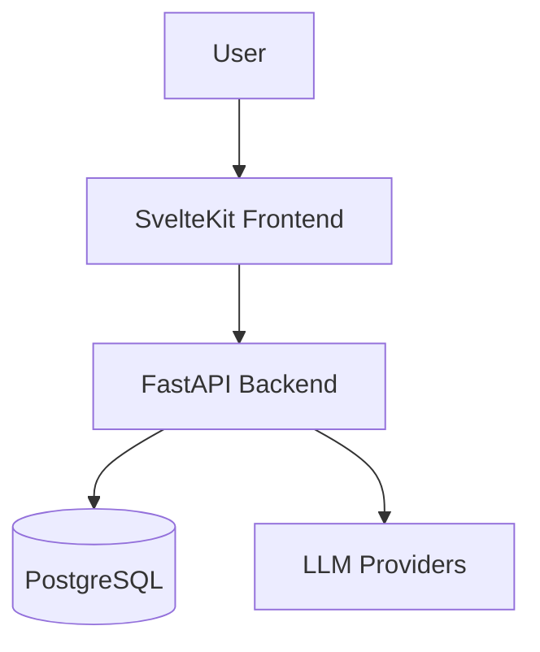

# Votecatcher Documentation Strategy

**Principle:** Documentation should be automated where possible, minimal but sufficient, and scaled to project size (MVP, single developer, 4-6 weeks).

---

## Documentation Structure

```
docs/
├── architecture/
│   ├── README.md              # Architecture overview
│   ├── c4-context.md          # C4 Level 1: System Context
│   ├── c4-containers.md       # C4 Level 2: Containers
│   ├── c4-components.md       # C4 Level 3: Components (backend only)
│   └── decisions/             # Architecture Decision Records (ADRs)
│       ├── README.md          # ADR index
│       ├── 0001-record-architecture-decisions.md
│       ├── 0002-use-fastapi-background-tasks.md
│       └── ...
│
├── api/
│   ├── README.md              # API documentation overview
│   └── openapi.yaml           # OpenAPI spec (source of truth)
│
├── development/
│   ├── README.md              # Development guide
│   ├── setup.md               # Local development setup
│   ├── testing.md             # Testing strategy
│   └── contributing.md        # Contribution guidelines
│
└── deployment/
    ├── README.md              # Deployment overview
    └── vps-deployment.md      # Single VPS deployment guide
```

---

## Documentation Types & Tools

### 1. Architecture Diagrams (C4 Model)

**Tool:** Mermaid.js (embedded in Markdown, renders in GitHub)

**Scope for MVP:**
| Level | What | When to Create |
|-------|------|----------------|
| Context | System in its environment | Phase 0 |
| Containers | Backend, Frontend, DB, External APIs | Phase 0 |
| Components | Backend services only | Phase 2 |

**Why Mermaid:**
- ✅ Lives in markdown (version controlled)
- ✅ Renders natively in GitHub
- ✅ No external tools needed
- ✅ Easy to update

**Example:**


### 2. Architecture Decision Records (ADRs)

**Tool:** MADR template (simplified for this project)

**When to create:**
- Any decision that affects architecture
- Any decision that would be hard to reverse
- Any decision with significant trade-offs

**Location:** `docs/architecture/decisions/`

**Naming:** `NNNN-short-title.md` (e.g., `0002-use-sse-for-realtime-updates.md`)

**Template:** See `docs/architecture/decisions/template.md`

### 3. API Documentation

**Tool:** OpenAPI 3.1 specification (already planned)

**Generation:**
- Write spec first (Phase 0)
- Generate TypeScript client from spec
- Use Redoc or Swagger UI for viewing

**Location:** `docs/api/openapi.yaml`

### 4. Glossary / Ubiquitous Language

**Tool:** Contextive (optional, or simple markdown table)

**For MVP:** Simple markdown table in README is sufficient.

**When to use Contextive:**
- If the project grows beyond MVP
- If multiple developers join
- If domain terminology becomes complex

### 5. Code Documentation

**Backend (Python):**
- Docstrings for public functions/classes
- Type hints (enforced by basedpyright)
- Inline comments for complex logic only

**Frontend (TypeScript):**
- JSDoc for public functions
- Type annotations
- Component documentation in Storybook (stretch goal)

---

## Documentation Tasks by Phase

### Phase 0: Setup
- [ ] Create `docs/` directory structure
- [ ] Write C4 Context diagram (Mermaid)
- [ ] Write C4 Containers diagram (Mermaid)
- [ ] Create ADR template
- [ ] Create first ADR: "Record Architecture Decisions"
- [ ] Set up OpenAPI spec file
- [ ] Update README.md with documentation links

### Phase 1: Data Layer
- [ ] Generate ERD from SQLModel (if automated tool available)
- [ ] Document database schema decisions (if non-obvious)

### Phase 2: Backend Services
- [x] Write C4 Components diagram for backend
- [x] Create ADRs for major decisions (OCR client abstraction, job orchestration, matching strategy)
- [x] Document confidence calibration results
- [x] ADR-0006: Spec-driven field configuration
- [x] ADR-0007: Feature flag lifecycle framework
- [x] ADR-0008: Template-based field rendering
- [x] C4 Components updated with FieldSpecService, VoterDataAdapter, FieldSpecRepo

### Phase 3: Frontend Foundation
- [ ] Document frontend architecture decisions (if non-obvious)

### Phase 4: Integration
- [ ] Document session management approach
- [ ] Update diagrams if architecture changed

### Phase 5: Polish
- [ ] Write comprehensive README.md
- [ ] Write development setup guide
- [ ] Write deployment guide
- [ ] Verify all documentation links
- [ ] Ensure diagrams are current

---

## README.md Structure

```markdown
# Votecatcher

Brief description (1-2 sentences)

## Quick Start
- Prerequisites
- Installation
- Running locally

## Documentation
- [Architecture](docs/architecture/README.md) - System design and decisions
- [API Reference](docs/api/README.md) - API documentation
- [Development](docs/development/README.md) - Local development guide
- [Deployment](docs/deployment/README.md) - Deployment guides

## Features
- Feature list with links to docs

## Contributing
- Link to contributing guide

## License
MIT
```

---

## Automation Opportunities

### Diagram Generation

| Diagram Type | Tool | Automation Level |
|--------------|------|------------------|
| C4 diagrams | Mermaid | Manual (but easy to edit) |
| ERD | ERAlchemy oreral | Can generate from models |
| Sequence diagrams | Mermaid | Manual |
| API docs | OpenAPI + Redoc | Fully automated |

### ERD Generation (Optional)

If using SQLModel/SQLAlchemy, can generate ERD:

```bash
# Using eralchemy
pip install eralchemy
eralchemy -i 'sqlite:///dev.db' -o docs/architecture/erd.png

# Or using schemaspy (more detailed)
java -jar schemaspy.jar -t pgsql -db votecatcher -o docs/architecture/database/
```

**For MVP:** A Mermaid ERD is sufficient.

---

## ADR Template (MADR Simplified)

```markdown
# ADR-NNNN: [Short Title]

## Status
[Proposed | Accepted | Deprecated | Superseded]

## Context
What is the issue that we're seeing that motivates this decision?

## Decision
What is the change that we're proposing/have made?

## Consequences
What becomes easier or more difficult because of this change?

## Alternatives Considered
What other options were considered? Why were they not chosen?
```

---

## Documentation Maintenance

### When to Update

| Trigger | What to Update |
|---------|----------------|
| New feature | README, API docs, possibly diagrams |
| Architecture change | C4 diagrams, ADR |
| API change | OpenAPI spec |
| Deployment change | Deployment guide |
| New dependency | README prerequisites |

### Review Checkpoints

- **Phase sign-off:** Verify docs are current
- **Before demo:** Full documentation review
- **Post-MVP:** Clean up and consolidate

---

## Tools Reference

| Tool | Purpose | Use for MVP? |
|------|---------|--------------|
| **Mermaid** | Diagrams in Markdown | ✅ Yes - Primary tool |
| **OpenAPI** | API specification | ✅ Yes - Already planned |
| **MADR** | ADR template | ✅ Yes - Simplified version |
| **ERAlchemy** | ERD from database | ⚠️ Optional - Mermaid sufficient |
| **Contextive** | Glossary management | ❌ No - Overkill for MVP |
| **Keadex** | C4 with AI | ❌ No - Mermaid sufficient |
| **Swagger/Redoc** | API docs viewer | ✅ Yes - From OpenAPI |
| **Storybook** | Component docs | ❌ No - Stretch goal |

---

## Pre-existing Documentation

The following documentation already exists and should be preserved:

| Location | Purpose | Keep? |
|----------|---------|-------|
| `.agent-workspace/problem/REQUIREMENTS.md` | Source requirements | ✅ Reference only |
| `openspec/SPEC.md` | Technical specification | ✅ Implementation blueprint |
| `openspec/TODO.md` | Task tracking | ✅ During implementation |
| `.agent-workspace/design-session/*.md` | Design session outputs | ✅ Reference, can consolidate into docs/ |

### Migration Strategy

After Phase 5, consider consolidating:
- `design-session/data-model.md` → `docs/architecture/data-model.md`
- `design-session/api-spec.md` → `docs/api/` (merge with OpenAPI)
- `design-session/architecture.md` → `docs/architecture/` (extract diagrams)
- Keep `design-session/` as historical record

---

## Success Metrics

Documentation is sufficient if:

- [ ] A new developer can set up the project from README alone
- [ ] All major architectural decisions have ADRs
- [ ] C4 diagrams accurately represent the system
- [ ] API documentation covers all endpoints
- [ ] Deployment guide has been tested on a clean machine
