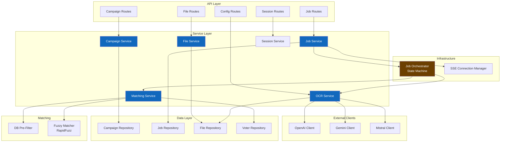
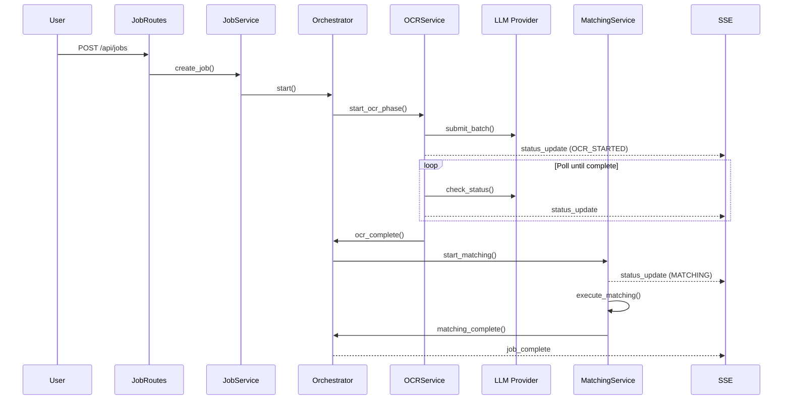

# C4 Components Diagram (Backend)

> Level 3: Components - Shows the internal structure of the FastAPI Backend container

## Diagram

## Component Descriptions

### API Layer (Routes)

| Component | Responsibility |
|-----------|----------------|
| Campaign Routes | Handle campaign CRUD operations |
| Job Routes | Handle job creation, status, cancellation |
| File Routes | Handle file uploads (petitions, voter lists) |
| Config Routes | Handle OCR provider configuration |
| Session Routes | Handle session save/load/export |

### Service Layer

| Component | Responsibility |
|-----------|----------------|
| Campaign Service | Business logic for campaign management |
| Job Service | Job lifecycle management, status updates |
| File Service | File upload, PDF cropping, storage |
| OCR Service | OCR job creation, batch submission, polling |
| Matching Service | Fuzzy matching execution, result storage |
| Session Service | Session persistence, export/import |

### Infrastructure

| Component | Responsibility |
|-----------|----------------|
| Job Orchestrator | State machine for job phases (OCR → Matching) |
| SSE Manager | Manage real-time connections, broadcast updates |

### External Clients

| Component | Responsibility |
|-----------|----------------|
| OpenAI Client | OpenAI batch API integration |
| Gemini Client | Gemini batch API integration |
| Mistral Client | Mistral batch API integration |

### Data Layer (Repositories)

| Component | Responsibility |
|-----------|----------------|
| Campaign Repository | Database operations for campaigns |
| Job Repository | Database operations for jobs |
| File Repository | Database operations for files, crops |
| Voter Repository | Database operations for voter lists |

### Matching Components

| Component | Responsibility |
|-----------|----------------|
| DB Pre-Filter | Filter voter list by region, zipcode |
| Fuzzy Matcher | RapidFuzz-based name/address matching |

## Key Interactions

### End-to-End Job Flow

## Related Diagrams

- [Containers Diagram](./c4-containers.md) - Previous level: system containers
- [Back to Architecture](./README.md)
