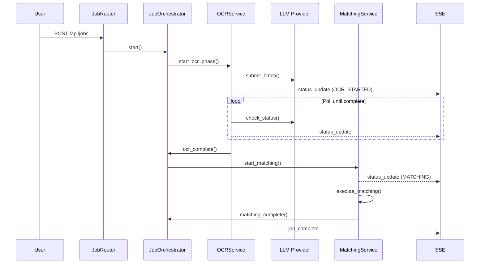

# C4 Components Diagram (Backend)

> Level 3: Components - Shows the internal structure of the FastAPI Backend container

## Diagram

```mermaid
graph TB
    subgraph API Layer - 9 Routers
        CampaignRouter[campaign_router]
        JobRouter[job_router]
        UploadRouter[upload_router]
        ConfigRouter[config_router]
        SessionRouter[session_router]
        DemoRouter[demo_router]
        EventsRouter[events_router]
        ProviderRouter[provider_router]
        RegionRouter[region_router]
        ResultsRouter[results_router]
        DatabaseRouter[database_router]
    end

    subgraph Service Layer
        MetricsService[metrics.py]
        ProvidersService[providers.py]
        SupabaseService[supabase_service.py]
        VoterListService[voter_list_service.py]
    end

    subgraph Infrastructure
        JobOrchestrator[Job Orchestrator<br/>State Machine]
        SSEManager[SSE Connection Manager]
    end

    subgraph OCR Module
        OCRManager[ocr_manager.py]
        OCRService[ocr_service.py]
        OCRClientFactory[ocr_client_factory.py]
        subgraph OCR Clients
            OpenAIClient[open_ai.py]
            GeminiClient[gemini.py]
            MistralClient[mistral.py]
        end
        subgraph OCR Batching
            BatchHandler[batch_handler.py]
            BatchOCRClient[batch_ocr_client.py]
            OpenAIBatch[openai_ocr_batch.py]
            GeminiBatch[gemini_ocr_batch.py]
            MistralBatch[mistral_ocr_batch.py]
            MemoryBatching[memory_batching.py]
            MemoryJobMonitor[memory_job_monitor.py]
        end
    end

    subgraph Matching Module
        MatchingService[matching_service.py]
        FuzzyMatchHelper[fuzzy_match_helper.py]
        MatchColumns[match_columns.py]
        MatchRepository[match_repository.py]
    end

    subgraph Data Layer - Repositories
        CampaignRepo[campaign_repo.py]
        VoterRepo[voter_repo.py]
        PetitionRepo[petition_repo.py]
    end

    CampaignRouter --> CampaignRepo
    JobRouter --> JobOrchestrator
    UploadRouter --> VoterListService
    ConfigRouter --> OCRClientFactory
    SessionRouter --> SupabaseService
    DemoRouter --> VoterListService
    EventsRouter --> SSEManager
    ProviderRouter --> ProvidersService
    RegionRouter --> VoterRepo
    ResultsRouter --> MatchRepository

    JobOrchestrator --> OCRManager
    JobOrchestrator --> MatchingService

    OCRManager --> OCRService
    OCRService --> OCRClientFactory
    OCRClientFactory --> OpenAIClient
    OCRClientFactory --> GeminiClient
    OCRClientFactory --> MistralClient

    OCRService --> BatchHandler
    BatchHandler --> BatchOCRClient
    BatchOCRClient --> OpenAIBatch
    BatchOCRClient --> GeminiBatch
    BatchOCRClient --> MistralBatch
    BatchHandler --> MemoryBatching
    BatchHandler --> MemoryJobMonitor

    MatchingService --> FuzzyMatchHelper
    MatchingService --> MatchColumns
    MatchingService --> MatchRepository
    MatchingService --> VoterRepo

    style OCRManager fill:#1168bd,color:#fff
    style MatchingService fill:#1168bd,color:#fff
    style JobOrchestrator fill:#6c3f00,color:#fff
```

## Component Descriptions

### API Layer (Routers)

| Router | File | Responsibility |
|--------|------|----------------|
| campaign_router | `campaign_router.py` | Campaign CRUD operations |
| job_router | `job_router.py` | Job creation, status, cancellation |
| upload_router | `upload_router.py` | File uploads (petitions, voter lists) |
| config_router | `config_router.py` | OCR provider configuration |
| session_router | `session_router.py` | Session save/load/export |
| demo_router | `demo_router.py` | Demo mode operations |
| events_router | `events_router.py` | SSE real-time event streaming |
| provider_router | `provider_router.py` | LLM provider management |
| region_router | `region_router.py` | Region CRUD operations |
| results_router | `results_router.py` | Match results retrieval |
| database_router | `database_router.py` | Database health and status |

### Service Layer

| Service | File | Responsibility |
|---------|------|----------------|
| metrics | `metrics.py` | Application metrics collection |
| providers | `providers.py` | LLM provider registry and selection |
| supabase_service | `supabase_service.py` | Supabase integration |
| voter_list_service | `voter_list_service.py` | Voter list import and parsing |

### OCR Module

| Component | File | Responsibility |
|-----------|------|----------------|
| OCR Manager | `ocr_manager.py` | High-level OCR orchestration |
| OCR Service | `ocr_service.py` | OCR job lifecycle management |
| Client Factory | `ocr_client_factory.py` | Create provider-specific OCR clients |
| OpenAI Client | `clients/open_ai.py` | OpenAI API integration |
| Gemini Client | `clients/gemini.py` | Gemini API integration |
| Mistral Client | `clients/mistral.py` | Mistral API integration |
| Batch Handler | `batching/batch_handler.py` | Batch OCR submission orchestration |
| Batch OCR Client | `batching/batch_ocr_client.py` | Provider-agnostic batch client |
| Memory Batching | `batching/memory_batching.py` | In-memory batch state management |
| Memory Job Monitor | `batching/memory_job_monitor.py` | In-memory job status tracking |

### Matching Module

| Component | File | Responsibility |
|-----------|------|----------------|
| Matching Service | `matching_service.py` | Fuzzy matching orchestration |
| Fuzzy Match Helper | `fuzzy_match_helper.py` | RapidFuzz-based name/address matching |
| Match Columns | `match_columns.py` | Column-level comparison logic |
| Match Repository | `match_repository.py` | Match result persistence |

### Data Layer (Repositories)

| Repository | File | Responsibility |
|------------|------|----------------|
| Campaign Repo | `repositories/campaign_repo.py` | Campaign database operations |
| Voter Repo | `repositories/voter_repo.py` | Voter list database operations |
| Petition Repo | `repositories/petition_repo.py` | Petition and crop database operations |

### Infrastructure

| Component | Responsibility |
|-----------|----------------|
| Job Orchestrator | State machine for job phases (OCR -> Matching) |
| SSE Manager | Manage real-time connections, broadcast updates |

## Key Interactions

### End-to-End Job Flow

## Related Diagrams

- [Containers Diagram](./c4-containers.md) - Previous level: system containers
- [Back to Architecture](./README.md)
