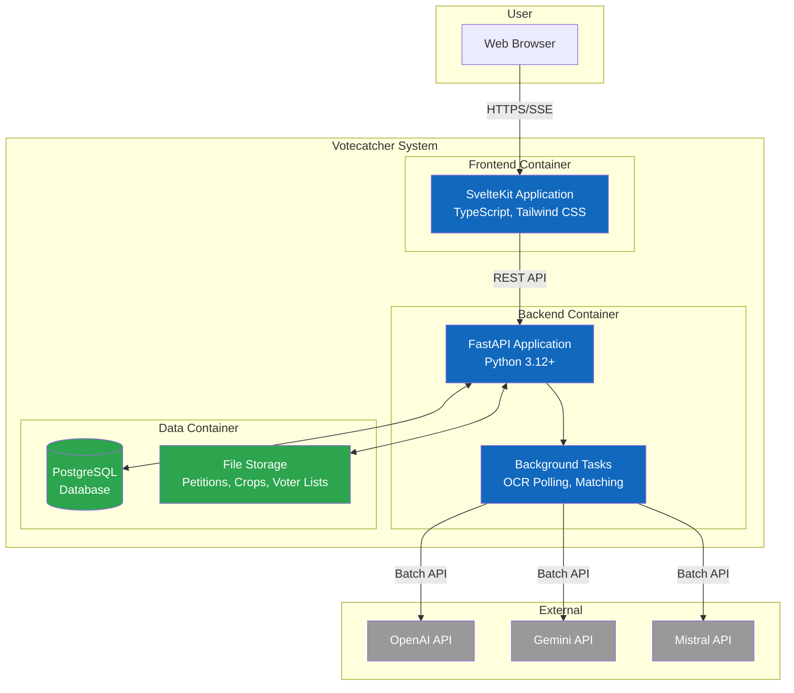

# C4 Containers Diagram

> Level 2: Containers - Shows applications and data stores that make up Votecatcher

## Diagram



## Container Descriptions

| Container | Technology | Description |
|-----------|------------|-------------|
| **SvelteKit Application** | SvelteKit, TypeScript, Tailwind CSS | Single-page application providing UI for campaign management, file upload, job monitoring, and results visualization |
| **FastAPI Application** | Python 3.12+, FastAPI, SQLModel | REST API server handling all business logic, file processing, job orchestration |
| **Background Tasks** | FastAPI BackgroundTasks | Async polling of LLM batch APIs, fuzzy matching execution |
| **PostgreSQL Database** | PostgreSQL (or SQLite for dev) | Persistent storage for campaigns, jobs, OCR results, match results, sessions |
| **File Storage** | Local filesystem | Storage for uploaded petitions, cropped images, voter lists |

## Communication Protocols

| From | To | Protocol | Purpose |
|------|-----|----------|---------|
| Browser | SvelteKit | HTTPS | Serve frontend application |
| SvelteKit | FastAPI | REST (HTTPS) | API calls for all operations |
| SvelteKit | FastAPI | SSE | Real-time job status updates |
| FastAPI | PostgreSQL | TCP (5432) | Database queries |
| Background Tasks | LLM APIs | HTTPS | Batch OCR processing |

## Deployment

All containers run on a single VPS:

```
┌─────────────────────────────────────────┐
│  VPS (Ubuntu 22.04, $5-20/mo)          │
│                                         │
│  ┌─────────────┐  ┌─────────────────┐  │
│  │ Caddy       │  │ PostgreSQL      │  │
│  │ (Reverse    │  │ (Database)      │  │
│  │  Proxy)     │  └─────────────────┘  │
│  └──────┬──────┘                       │
│         │                               │
│  ┌──────┴──────────────────────────┐   │
│  │ Docker Compose                  │   │
│  │  ├── Frontend (static files)    │   │
│  │  ├── Backend (uvicorn)          │   │
│  │  └── Volumes (file storage)     │   │
│  └─────────────────────────────────┘   │
└─────────────────────────────────────────┘
```

## Related Diagrams

- [Context Diagram](./c4-context.md) - Previous level: system in environment
- [Components Diagram](./c4-components.md) - Next level: backend decomposition
- [Back to Architecture](./README.md)
