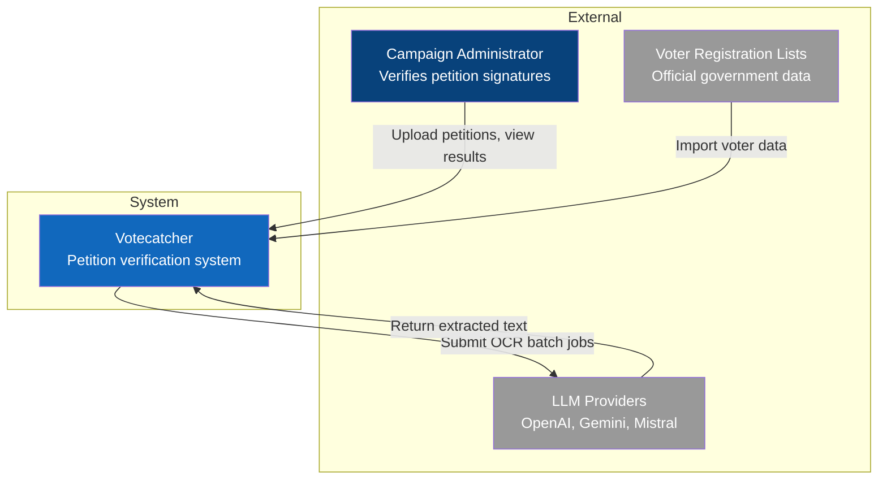

# C4 Context Diagram

> Level 1: System Context - Shows Votecatcher in its environment

## Diagram

## Description

Votecatcher is a petition signature verification system used by campaign administrators to automate the process of matching handwritten signatures from petition scans against official voter registration lists.

### External Actors

| Actor | Description | Interaction |
|-------|-------------|-------------|
| Campaign Administrator | Person responsible for verifying petition signatures | Uploads petitions, voter lists; reviews matching results |
| LLM Providers | External AI services providing OCR capabilities | Receives batch image processing requests; returns extracted text |
| Voter Registration Lists | Official government voter data | Source data for matching signatures |

### System Context

- **Primary users:** Campaign administrators (1-5 concurrent)
- **External dependencies:** LLM provider APIs (OpenAI, Gemini, or Mistral)
- **Data sources:** Official voter registration lists (CSV/Excel)
- **Deployment:** Self-hosted on single VPS ($5-20/mo)

## Related Diagrams

- [Containers Diagram](./c4-containers.md) - Next level: application decomposition
- [Back to Architecture](./README.md)
