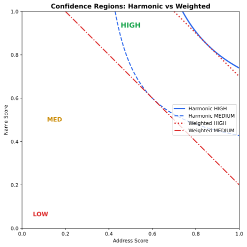
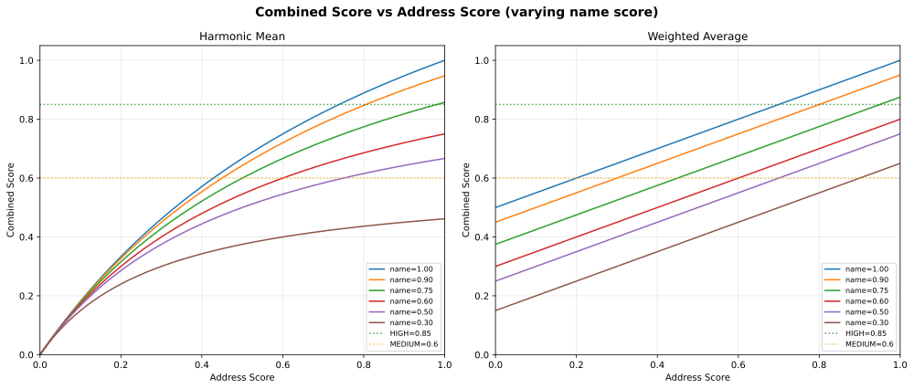

# Matching Algorithm — Spec-Driven

This document describes the **spec-driven matching algorithm** that replaced the
original hardcoded DC-specific matching pipeline. It supports configurable field
specs loaded from JSON5 source files, pluggable score aggregation engines, and
hexagonal architecture (Pydantic domain → services → adapters).

## Algorithm Overview

The algorithm matches OCR-extracted petition signer data against voter
registration lists using a two-phase pipeline:

1. **Field rendering**: For each voter, render template strings from structured
   field data (e.g., `"{street_number} {street_name} {street_type}"` → `"23407 Hawkins Lock"`)
2. **Score aggregation**: Compute per-field fuzzy scores via `fuzz.ratio`, then
   combine into a single similarity score using a pluggable `ScoreAggregator`

### Source

`app/matching/matching_service.py`, `app/matching/engines.py`

## Score Aggregation Engines

The combined score is computed by a `ScoreAggregator` — a Protocol-based
strategy that can be swapped via the `MATCHING_ENGINE` setting.

### Harmonic Mean (default)

```
H = 2 × name_score × addr_score / (name_score + addr_score)
```

Generalized to N fields with weights:

```
H = Σ(w_i) / Σ(w_i / s_i)    where s_i > 0 for all i
```

If **any** field scores 0.0, the combined score is 0.0 (zero-propagating).
This is the conservative choice: both name AND address must be reasonable
matches — a perfect name with a garbage address won't produce a misleadingly
high score.

This engine produces **exact parity** with the legacy algorithm (commit
`11b9617`) when using the demo spec with equal weights:

| Metric | Harmonic vs Gold Master |
|--------|------------------------|
| Same top voter | 50/50 (100%) |
| Same confidence | 50/50 (100%) |
| Score delta | 0.000000 |
| Max |delta| | 0.000000 |

### Weighted Average

```
W = Σ(s_i × w_i) / Σ(w_i)
```

Arithmetic mean weighted by `BallotField.match_weight`. More permissive than
harmonic when scores are imbalanced — a strong name match can partially
compensate for a weak address match.

### Comparison

| Property | Harmonic | Weighted Average |
|----------|----------|------------------|
| Zero-propagating | Yes — any 0.0 → combined=0.0 | No — zeros reduce average |
| Imbalanced penalty | Strong — penalizes one weak field | Weak — averages across fields |
| Gold master parity | Exact (±0.0000) | Approximate (+0.052 max delta) |
| Same top voter | 50/50 | 44/50 |
| Best for | Petition validation (both fields matter) | Fuzzy search (one strong signal enough) |

### Visual Comparison

The graphs below show how each engine combines name and address scores:

**Combined Score Surfaces** — darker = lower combined score. The harmonic
engine's valley (dark region) extends further into the imbalanced zone:


**Delta Heatmap** — where the two engines diverge. Largest differences appear
when one score is high and the other low:


**Confidence Regions** — boundary lines for HIGH (≥0.85) and MEDIUM (≥0.60)
thresholds. The harmonic engine requires both fields to be stronger to reach
HIGH confidence:



**Score Profiles** — combined score as address varies, at fixed name score
levels. The harmonic curves drop faster for low address scores:



## Configuration

### Engine Selection

Set via environment variable or `.env`:

```bash
MATCHING_ENGINE=harmonic   # default — exact gold master parity
MATCHING_ENGINE=weighted   # arithmetic mean — more permissive
```

### Adding a New Engine

1. Implement the `ScoreAggregator` protocol in `app/matching/engines.py`:

```python
class MyEngine:
    @property
    def name(self) -> str:
        return "my_engine"

    def aggregate(self, field_scores: dict[str, float], weights: dict[str, float]) -> float:
        # custom logic
        ...
```

2. Register in `_ENGINES` dict in `engines.py`
3. Set `MATCHING_ENGINE=my_engine`

### Per-Region Spec

Field composition is defined in JSON5 specs (`app/regions/*.json5`). Each spec
declares ballot fields, voter registration fields, field mappings with
templates, and match weights. See `docs/development/field-spec-schema.md` for
the full schema.

## Confidence Levels

Same thresholds as the legacy algorithm:

| Level | Threshold | Description |
|-------|-----------|-------------|
| HIGH | `>= 0.85` | Strong match |
| MEDIUM | `>= 0.60` | Needs review |
| LOW | `< 0.60` | Unlikely match |

## Matching Process

1. Load region spec from DB (loaded from JSON5 at startup)
2. Pre-filter voters by region (and optionally by a spec-defined field like zip code)
3. For each OCR result:
   - Render voter field templates via `render_template()` (handles empty fields, NA sentinels, whitespace normalization)
   - Compute `fuzz.ratio` for each matchable ballot field
   - Aggregate via configured `ScoreAggregator`
   - Sort by combined score, return top N
4. Assign confidence level based on combined score

## Parity Testing

Three locked approval baselines guard against regression:

1. **Gold master** — old algorithm baseline (50 OCR × 100K voters)
2. **Spec vs legacy parity** — synthetic voters, both data formats produce identical scores
3. **Live OCR approval** — 50 real OCR results against spec and legacy voters

Tests use `approvaltests.verify()` and exercise the public API
(`MatchingService.calculate_spec_driven_similarity`).

## Generating Engine Graphs

```bash
cd backend
uv run python3 scripts/generate_engine_graphs.py
```

Outputs SVGs to `docs/development/img/`. Re-run when adding new engines or
changing thresholds.
