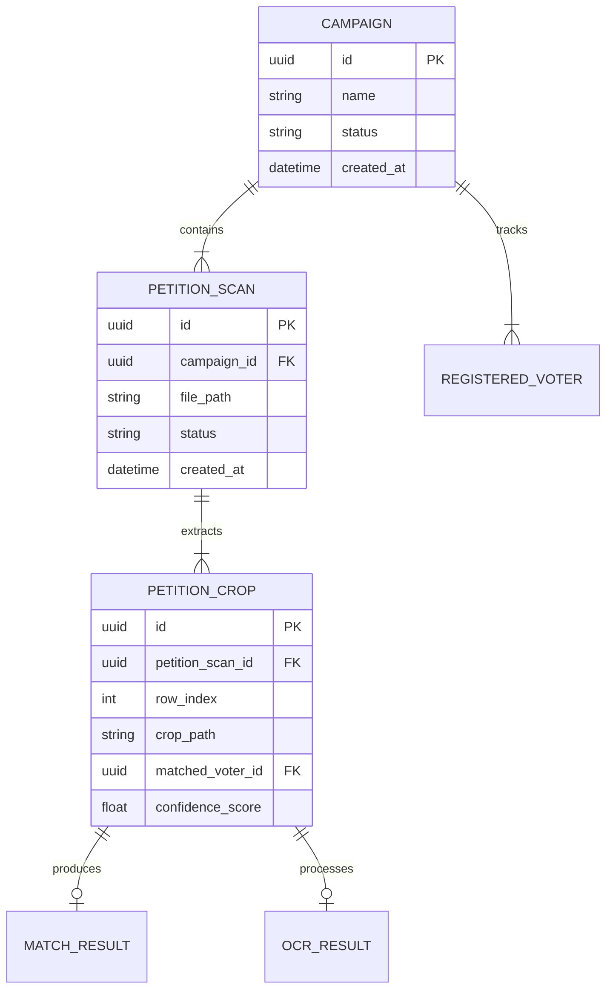

# Supabase Integration & Configuration Architecture

**Date:** 2026-03-26
**Status:** Approved
**Authors:** Kurian, Claude

---

## Overview

Design a unified system for connecting Votecatcher to Supabase, reorganizing configuration architecture for security and maintainability, and abstracting persistence layer to keep business logic database-agnostic.

---

## Goals

1. **Supabase onboarding** — UI wizard + CLI for connecting and provisioning
2. **Configuration consolidation** — Single source of truth, type-safe, secure
3. **Persistence abstraction** — Business logic unaware of database type
4. **Security** — Secret masking, pre-commit scanning, no leaked credentials

---

## Non-Goals

- Multi-tenant Supabase support (one project per deployment)
- OAuth-based Supabase connection (not supported by Supabase)
- Row-level security policies (future enhancement)
- Supabase Auth integration (using own auth system)

---

## Security Considerations

> ⚠️ **Important:** The `service_role` key grants full database access, bypassing RLS. Users must understand this key could delete all data. Document clearly, encourage key rotation, and recommend per-deployment Supabase projects to limit blast radius.

---

## Architecture

### Layer Overview

```
┌─────────────────────────────────────────────┐
│  API Routes / Routers                       │  ← HTTP boundary
├─────────────────────────────────────────────┤
│  Services / Business Logic                  │  ← Core domain
│    - Knows about repositories (interfaces)  │
│    - Does NOT know about engines/databases  │
├─────────────────────────────────────────────┤
│  Repositories                               │  ← Data access abstraction
│    - Implements repository contracts        │
│    - Translates domain objects ↔ SQLModel   │
├─────────────────────────────────────────────┤
│  Persistence Engines                        │  ← Infrastructure
│    - SQLite, Postgres, Supabase, Memory     │
│    - Implements engine contracts            │
└─────────────────────────────────────────────┘
```

---

## Section 1: Configuration Architecture

### File Structure

```
backend/
├── .env.example              # Template (committed)
├── .env.local                # Local secrets (gitignored)
├── .env.development          # Dev environment (gitignored)
├── .env.production           # Production (gitignored)
└── app/
    └── settings/
        ├── __init__.py       # Public interface: get_settings()
        ├── contracts.py      # Interface definitions
        ├── sources/
        │   ├── __init__.py
        │   ├── env_file.py   # .env file loader
        │   └── environment.py # OS env vars
        ├── providers/
        │   ├── __init__.py
        │   ├── database_config.py
        │   ├── ocr_config.py
        │   ├── feature_config.py
        │   └── supabase_config.py
        └── settings.py       # Aggregates all providers
```

### Env File Loading

**Priority order:**
```
.env.local → .env.{NODE_ENV}
```

**Files:**

| File | Purpose | Git |
|------|---------|-----|
| `.env.example` | Template with fake values | Committed |
| `.env.local` | All secrets | Gitignored |
| `.env.development` | Dev-specific config | Gitignored |
| `.env.production` | Production config | Gitignored |

### Public Interface

```python
# app/settings/__init__.py
from app.settings.settings import Settings, get_settings

# Single entry point
settings = get_settings()
settings.database.url           # Database connection
settings.ocr.provider_name      # OCR configuration
settings.features.simulation    # Feature flags
settings.supabase.is_connected  # Supabase status
```

### Contracts

```python
# app/settings/contracts.py
from typing import Protocol
from pydantic import SecretStr

class ProvidesDatabaseConfig(Protocol):
    """Any source that provides database configuration."""
    @property
    def url(self) -> str: ...
    @property
    def type(self) -> str: ...  # "sqlite", "postgres", "supabase"

class ProvidesSupabaseConfig(Protocol):
    """Supabase-specific configuration."""
    @property
    def url(self) -> str: ...
    @property
    def service_key(self) -> SecretStr: ...
    @property
    def is_connected(self) -> bool: ...
    @property
    def database_url(self) -> str: ...
```

---

## Section 2: Persistence Architecture

### File Structure

```
backend/app/data/
├── __init__.py
├── domain/                       # Business objects
│   ├── __init__.py
│   ├── petition.py
│   ├── campaign.py
│   ├── voter.py
│   ├── job.py
│   └── user.py
├── persistence/                  # Infrastructure
│   ├── __init__.py
│   ├── contracts.py              # Engine interfaces
│   ├── engines/
│   │   ├── __init__.py
│   │   ├── sqlite.py
│   │   ├── postgres.py
│   │   ├── supabase.py
│   │   └── memory.py
│   ├── models/                   # SQLModel definitions
│   │   ├── __init__.py
│   │   ├── petition.py
│   │   ├── campaign.py
│   │   └── ...
│   └── session.py                # Session management
└── repositories/                 # Data access
    ├── __init__.py
    ├── contracts.py              # Repository interfaces
    ├── petition_repo.py
    ├── campaign_repo.py
    └── voter_repo.py
```

### Engine Contracts

```python
# app/data/persistence/contracts.py
from typing import Protocol
from sqlmodel import Session

class ProvidesEngine(Protocol):
    """Any database engine that can create sessions."""

    @property
    def name(self) -> str:
        """Human-readable name (sqlite, postgres, supabase)."""
        ...

    @property
    def connection_url(self) -> str:
        """Connection string (masked for logging)."""
        ...

    def create_session(self) -> Session:
        """Create a new database session."""
        ...

    def initialize(self) -> None:
        """Run migrations, create tables if needed."""
        ...

    def health_check(self) -> bool:
        """Verify database is reachable."""
        ...
```

### Repository Contracts

```python
# app/data/repositories/contracts.py
from typing import Protocol
from uuid import UUID

from app.domain.petition import Petition
from app.domain.campaign import Campaign
from app.domain.voter import RegisteredVoter

class PetitionRepository(Protocol):
    """Manages petition persistence."""

    def save(self, petition: Petition) -> Petition: ...
    def find_by_id(self, petition_id: UUID) -> Petition | None: ...
    def find_by_campaign(self, campaign_id: UUID) -> list[Petition]: ...

class CampaignRepository(Protocol):
    """Manages campaign persistence."""

    def save(self, campaign: Campaign) -> Campaign: ...
    def find_by_id(self, campaign_id: UUID) -> Campaign | None: ...
    def list_active(self) -> list[Campaign]: ...
```

### Engine Selection

```python
# app/data/persistence/session.py
from app.settings import get_settings
from app.data.persistence.engines import SqliteEngine, PostgresEngine, SupabaseEngine

def get_engine():
    """Select engine based on configuration."""
    settings = get_settings()

    if settings.supabase.is_connected:
        return SupabaseEngine(settings.supabase)

    if settings.database.type == "postgres":
        return PostgresEngine(settings.database.url)

    return SqliteEngine(settings.database.path)
```

### Domain vs Persistence Separation

| Aspect | Domain Object | Persistence Model |
|--------|---------------|-------------------|
| **Purpose** | Business logic | Database storage |
| **Structure** | Natural to domain | Optimized for queries |
| **Methods** | Business behaviors | Data access only |
| **Relationships** | Composed objects | Foreign keys |
| **Dependencies** | None (pure Python) | SQLModel |

---

## Section 3: Supabase Onboarding

### User Flow

```
User opens app (no DB configured)
        │
        ▼
    First-run check
        │
        ├─ Has database? → Skip onboarding
        │
        └─ No database? → Show wizard
                │
                ▼
        "Choose your database"
        ┌─────────────────────────────────────┐
        │  [SQLite]  (Local development)      │
        │  [Connect Supabase]                 │
        │  [PostgreSQL]  (Self-hosted)        │
        └─────────────────────────────────────┘
                │
                ▼ (if Supabase)
        "Connect to Supabase"
        ┌─────────────────────────────────────┐
        │  Project URL                        │
        │  [https://xyz.supabase.co        ] │
        │                                     │
        │  Service Role Key                   │
        │  [sb_secret_*********************] │
        │                                     │
        │  ⚠️ Full database access. Keep secure│
        │                                     │
        │  [Test Connection]                  │
        │  [Connect & Provision]              │
        └─────────────────────────────────────┘
                │
                ▼
        Validate → Provision → Save config
```

### UI Components

| Component | Location | Purpose |
|-----------|----------|---------|
| `OnboardingWizard` | `/onboarding` | Multi-step setup flow |
| `DatabaseSelector` | Step 1 | Choose database type |
| `SupabaseConnectForm` | Step 2 | Input credentials |
| `SettingsPage` | `/settings/database` | Reconfigure later |

---

## Section 4: API Endpoints

### Routes

```python
# app/routers/database_router.py
router = APIRouter(prefix="/database", tags=["database"])

@router.get("/status")
async def get_database_status() -> DatabaseStatus:
    """Check current database configuration."""
    ...

@router.post("/supabase/test")
async def test_supabase_connection(
    credentials: SupabaseCredentials
) -> ConnectionTestResult:
    """Validate credentials without saving."""
    ...

@router.post("/supabase/provision")
async def provision_supabase(
    credentials: SupabaseCredentials
) -> ProvisionResult:
    """Save credentials and run migrations."""
    ...

@router.delete("/supabase")
async def disconnect_supabase() -> dict:
    """Remove Supabase, return to SQLite."""
    ...
```

### Response Models

```python
class DatabaseStatus(BaseModel):
    configured: bool
    type: str  # "sqlite", "postgres", "supabase"
    connected: bool
    message: str

class SupabaseCredentials(BaseModel):
    project_url: str = Field(..., pattern=r"^https://[a-z0-9-]+\.supabase\.co$")
    service_key: SecretStr = Field(..., min_length=100)

class ConnectionTestResult(BaseModel):
    success: bool
    message: str
    project_ref: str | None = None

class ProvisionResult(BaseModel):
    success: bool
    message: str
    tables_created: list[str] | None = None
```

---

## Section 5: CLI Support

```bash
# backend/scripts/supabase_cli.py

Usage: python -m app.scripts.supabase [COMMAND]

Commands:
  connect       Configure Supabase connection
  test          Test current connection
  provision     Run migrations against Supabase
  status        Show current database config
  disconnect    Remove Supabase config

Examples:
  # Interactive
  python -m app.scripts.supabase connect

  # Non-interactive (CI/CD)
  python -m app.scripts.supabase connect \
    --url https://xyz.supabase.co \
    --key sb_secret_xxx \
    --provision
```

---

## Section 6: Docker Configuration

### docker-compose.yml (Local Dev)

```yaml
services:
  backend:
    build: ./backend
    ports: ["8080:8080"]
    environment:
      - DATABASE_URL=postgresql+psycopg://postgres:postgres@db:5432/votecatcher  # pragma: allowlist secret
    depends_on: [db]

  frontend:
    build: ./frontend-svelt
    ports: ["5173:5173"]
    depends_on: [backend]

  db:
    image: postgres:16-alpine
    environment:
      POSTGRES_USER: postgres
      POSTGRES_PASSWORD: postgres
      POSTGRES_DB: votecatcher
    volumes:
      - postgres_data:/var/lib/postgresql/data
```

### docker-compose.supabase.yml

```yaml
services:
  backend:
    build: ./backend
    ports: ["8080:8080"]
    env_file:
      - ./backend/.env.local
    # No db service needed

  frontend:
    build: ./frontend-svelt
    ports: ["5173:5173"]
    depends_on: [backend]
```

### Usage

```bash
# Local dev (default)
docker compose up

# Supabase backend
docker compose -f docker-compose.supabase.yml up
```

---

## Section 7: Security

### Secret Masking

All secrets use `pydantic.SecretStr`:

```python
class SupabaseConfig(BaseModel):
    service_key: SecretStr  # Never logged, never serialized

# str(config.service_key) → "**********"
# config.service_key.get_secret_value() → actual value
```

### Pre-commit Scanning

```yaml
# .pre-commit-config.yaml
- repo: https://github.com/gitleaks/gitleaks
  rev: v8.18.4
  hooks:
    - id: gitleaks
```

### Gitleaks Configuration

```toml
# .gitleaks.toml
title = "Votecatcher Secret Detection"

[extend]
useDefault = true

[[rules]]
id = "supabase-service-key"
description = "Supabase Service Role Key"
regex = '''sb_secret_[a-zA-Z0-9]{32,}'''
tags = ["supabase", "secret"]
```

### .gitignore

```
# Environment files
.env
.env.local
.env.*.local
.env.development
.env.production
```

---

## Implementation Phases

### Phase 1: Configuration Architecture (Foundation)
- Reorganize `app/settings/` with contracts/providers pattern
- Create `EnvFileSource` for `.env` loading
- Implement all config providers
- Migrate scattered `os.getenv()` calls to `get_settings()`
- Update `.env.example`

### Phase 2: Persistence Layer Refactor
- Create `app/data/persistence/` structure
- Implement engine contracts
- Create `SqliteEngine`, `PostgresEngine`, `SupabaseEngine`
- Create domain objects in `app/domain/`
- Implement repositories with translation layer
- Wire up dependency injection

### Phase 3: Supabase Onboarding UI
- Create onboarding wizard components
- Implement `/onboarding` route
- Add `/settings/database` page
- Connect to backend API

### Phase 4: Backend API & CLI
- Implement `/database/*` endpoints
- Create `supabase_cli.py` script
- Add Alembic integration

### Phase 5: Docker & CI/CD
- Create `docker-compose.supabase.yml`
- Add gitleaks to pre-commit
- Add secret scanning to CI
- Add schema docs generation script
- Add CI workflow for auto-generating schema docs
- Update documentation

---

## Open Questions

1. **Supabase DB password** — Should we require `SUPABASE_DB_PASSWORD` separately, or derive from service key?
2. **Migration rollback** — Should disconnect preserve data or offer rollback option?
3. **Multiple environments** — How to handle dev/staging/prod Supabase projects?

---

## Section 8: Schema Documentation

### Auto-Generated Database Diagrams

Use **eralchemy2** to generate ER diagrams from SQLModel/SQLAlchemy metadata. Supports multiple output formats.

**Output formats:**

| Format | Use Case | File |
|--------|----------|------|
| **Mermaid** | GitHub/docs rendering | `docs/database/schema.md` |
| **SVG** | High-quality docs | `docs/database/schema.svg` |
| **PNG** | Presentations | `docs/database/schema.png` |

### File Structure

```
backend/
└── scripts/
    └── generate_schema_docs.py

docs/
└── database/
    ├── schema.md           # Mermaid ERD (committed)
    ├── schema.svg          # Visual diagram (committed)
    └── README.md           # Documentation index
```

### Script Implementation

```python
# backend/scripts/generate_schema_docs.py
"""Auto-generate database schema documentation."""

from pathlib import Path
from sqlmodel import SQLModel
from eralchemy2 import render_er

# Import all models to register with metadata
from app.data.persistence.models import *

def generate_schema_docs(output_dir: Path = Path("docs/database")):
    """Generate schema documentation from SQLModel metadata."""
    output_dir.mkdir(parents=True, exist_ok=True)

    # Generate Mermaid ERD (renders in GitHub)
    render_er(
        SQLModel.metadata,
        str(output_dir / "schema.md"),
        mode="mermaid_er"
    )

    # Generate SVG for high-quality docs
    render_er(
        SQLModel.metadata,
        str(output_dir / "schema.svg")
    )

    # Generate PNG for presentations
    render_er(
        SQLModel.metadata,
        str(output_dir / "schema.png")
    )

    print(f"✅ Schema docs generated in {output_dir}")

if __name__ == "__main__":
    generate_schema_docs()
```

### Mermaid Output Example



### CI/CD Integration

```yaml
# .github/workflows/schema-docs.yml
name: Generate Schema Docs

on:
  push:
    paths:
      - 'backend/app/data/persistence/models/**'
      - 'backend/alembic/versions/**'

jobs:
  generate:
    runs-on: ubuntu-latest
    steps:
      - uses: actions/checkout@v4

      - name: Install dependencies
        run: |
          cd backend
          pip install eralchemy2[ci]

      - name: Generate schema docs
        run: python backend/scripts/generate_schema_docs.py

      - name: Commit changes
        run: |
          git config user.name "github-actions[bot]"
          git config user.email "github-actions[bot]@users.noreply.github.com"
          git add docs/database/
          git diff --quiet && git diff --staged --quiet || git commit -m "docs: update schema diagrams"
          git push
```

### Make/Just Targets

```make
# Makefile
schema-docs:
	cd backend && python scripts/generate_schema_docs.py

schema-view: schema-docs
	open docs/database/schema.svg
```

```
# justfile
schema-docs:
    cd backend && python scripts/generate_schema_docs.py

schema-view: schema-docs
    open docs/database/schema.svg
```

### Documentation Index

```markdown
# docs/database/README.md

# Database Schema

Auto-generated from SQLModel definitions. Last updated: 2026-03-26

## Diagrams

- [Mermaid ERD](./schema.md) - Renders in GitHub
- [SVG Diagram](./schema.svg) - High-quality vector
- [PNG Diagram](./schema.png) - For presentations

## Tables

| Table | Purpose | Relationships |
|-------|---------|---------------|
| `campaigns` | Election campaigns | Has many petition_scans, registered_voters |
| `petition_scans` | Uploaded petition PDFs | Belongs to campaign, has many crops |
| `petition_crops` | Extracted signature images | Belongs to scan, has match_result |
| `registered_voters` | Voter registration data | Belongs to campaign |
| `match_results` | Signature match results | Belongs to petition_crop |

## Regeneration

Run to regenerate after model changes:

```bash
make schema-docs
```
```

---

## References

- [Supabase API Keys Documentation](https://supabase.com/docs/guides/api/api-keys)
- [Alembic Documentation](https://alembic.sqlalchemy.org/)
- [Pydantic Settings](https://docs.pydantic.dev/latest/concepts/pydantic_settings/)
- [Gitleaks](https://github.com/gitleaks/gitleaks)
- [eralchemy2](https://github.com/maurerle/eralchemy2) - ER diagram generation
- [Mermaid ERD Syntax](https://mermaid.js.org/syntax/entityRelationshipDiagram.html)
