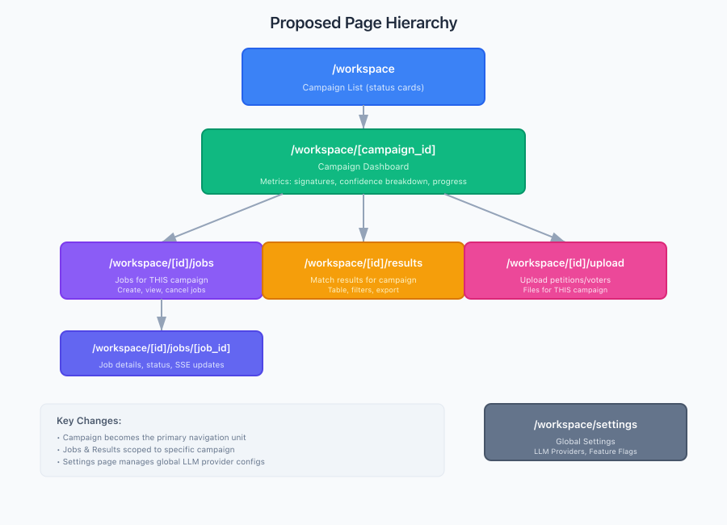
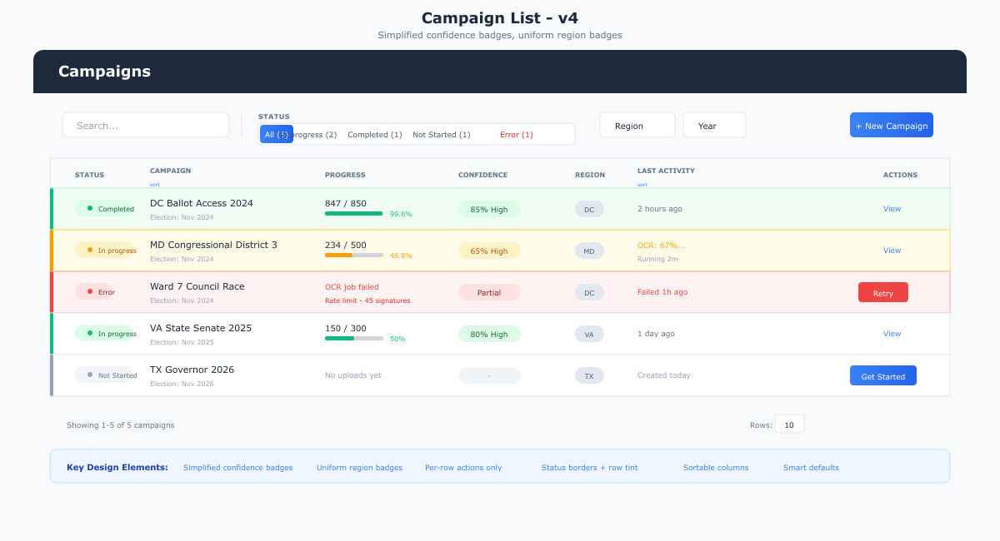
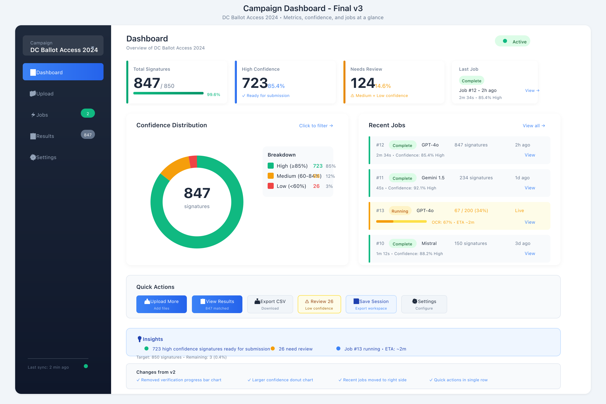
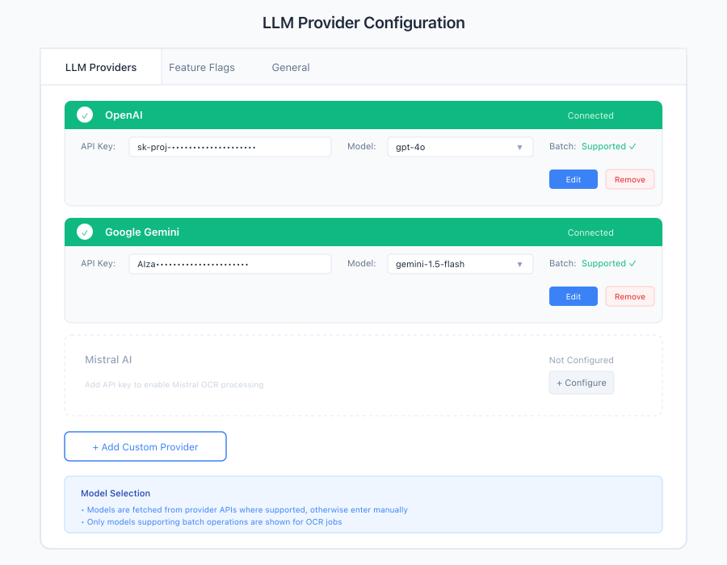
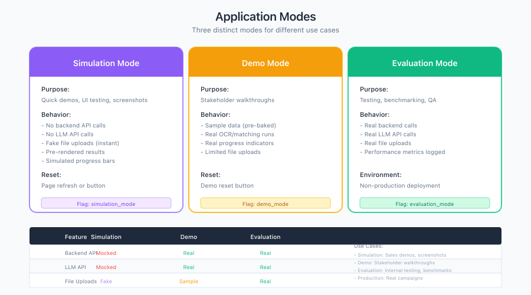

# Votecatcher Requirements Update

**Date:** 2026-03-11
**Type:** Requirements Change - Navigation, LLM Config & Application Modes
**Status:** Refined - Q&A Complete, Ready for Implementation

---

## MVP Completion Triage (2026-03-11)

### Scope Decisions

| Decision | Choice | Rationale |
|----------|--------|-----------|
| **Timeline** | 3-4 weeks (flexible) | Allow for page hierarchy refactor |
| **Priority** | Stability first | Worker tests, dashboard, errors before refactors |
| **Page Hierarchy** | Full redesign | Campaign-scoped routes (see §1 below) |
| **CSV Export (US-017)** | Defer | Users can view in UI |
| **Session Save/Load UI** | Minimal (pre-baked only) | Keep current demo mode |
| **Component Tests** | Defer | 221 failing (Svelte 5 + jsdom) |
| **Accessibility** | Baseline only | Keyboard nav + color contrast |
| **LLM Config (US-019)** | Include, plaintext DB | Plaintext API keys for MVP, encrypt post-MVP. Support .env fallback: `LLM_KEYS={"openai":"key","mistral":"key"}` |

### Implementation Phases (3-4 Week Sprint)

#### Phase 1: Page Hierarchy Redesign (Week 1) - MUST COMPLETE FIRST

> **Dependency Note:** Phase 1 must complete before Phase 2 (Stability) because dashboard metrics depend on the new `/workspace/[id]` route structure.

| Task | Priority | Effort | Status |
|------|----------|--------|--------|
| Restructure SvelteKit routes | HIGH | 1-2 days | Current: flat routes |
| Campaign dashboard at /workspace/[id] | HIGH | 1 day | New page |
| Campaign-scoped navigation | HIGH | 1 day | Sidebar refactor |
| Move upload/jobs/results under campaign | MEDIUM | 1 day | Route migration |

**New Route Structure:**
```
/                             → Marketing landing
/workspace                    → Campaign list
/workspace/[id]               → Campaign dashboard (NEW)
/workspace/[id]/upload        → Upload (scoped)
/workspace/[id]/jobs          → Jobs (scoped)
/workspace/[id]/results       → Results (scoped)
/workspace/settings           → Global settings
```

#### Phase 2: Stability (Week 2) - MUST COMPLETE

| Task | Priority | Effort | Status |
|------|----------|--------|--------|
| Background worker tests | HIGH | 4-6h | Not started |
| Dashboard metrics + US-022 merge | HIGH | 5-7h | Placeholder only |
| Error handling polish | MEDIUM | 2-3h | Baseline exists |

#### Phase 3: Polish (Week 2-3) - MUST COMPLETE

| Task | Priority | Effort | Status |
|------|----------|--------|--------|
| Accessibility baseline | MEDIUM | 4-6h | Not audited |
| E2E test suite | MEDIUM | 4-6h | 4 tests skipped |
| Documentation updates | LOW | 2-3h | Outdated |

#### Phase 4: New Features (Week 3-4) - IF TIME ALLOWS

| Task | Priority | Effort | Status |
|------|----------|--------|--------|
| LLM Config US-019 (no encryption) | HIGH | 2-3 days | Not started |
| Provider Selection US-020 | MEDIUM | 1-2 days | Not started |
| Campaign List minimal (US-018 partial) | LOW | 1-2 days | Not started |

**Total Effort:** 90-130 hours over 3-4 weeks

### MVP Acceptance Criteria

**Phase 1 (Page Hierarchy - Required for MVP):**
- [ ] Campaign-scoped routes work (/workspace/[id]/jobs, /workspace/[id]/results, etc.)
- [ ] Campaign dashboard at /workspace/[id]
- [ ] Campaign switcher in sidebar
- [ ] Root / landing page exists

**Phase 2 & 3 (Stability + Polish - Required for MVP):**
- [ ] Background worker tests pass
- [ ] Dashboard shows real metrics + confidence donut + quick actions
- [ ] User-friendly error messages
- [ ] Keyboard navigation works
- [ ] E2E full-flow test passes
- [ ] README updated

**Phase 4 (Stretch Goals):**
- [ ] LLM provider config in settings UI (plaintext DB, .env fallback)
- [ ] Provider dropdown on job creation
- [ ] Campaign list with status column + sorting

### MVP Task Details

#### 1.1 Page Hierarchy Redesign (HIGH)

**Current State:** Flat routes at `/workspace/*`

**BDD Scenarios:**

```gherkin
Feature: Campaign-Scoped Navigation

  Scenario: Navigate to campaign dashboard
    Given a campaign with ID 123 exists
    When I navigate to /workspace/123
    Then I see the campaign dashboard
    And the sidebar shows campaign-scoped navigation
    And the campaign name is in the header

  Scenario: Jobs are scoped to campaign
    Given campaign 123 has 2 jobs
    And campaign 456 has 3 jobs
    When I navigate to /workspace/123/jobs
    Then I see only jobs for campaign 123
    And I see 2 jobs in the list

  Scenario: Campaign switcher navigates
    Given I am on /workspace/123/jobs
    When I use the campaign switcher to select campaign 456
    Then I navigate to /workspace/456/jobs
    And I see jobs for campaign 456

  Scenario: Results scoped to campaign
    Given campaign 123 has 50 match results
    When I navigate to /workspace/123/results
    Then I see results for campaign 123 only
    And pagination works within campaign scope

  Scenario: Upload scoped to campaign
    Given I am on /workspace/123/upload
    When I upload a voter list
    Then it is associated with campaign 123
    When I upload a petition
    Then it is associated with campaign 123

  Scenario: Root landing page exists
    When I navigate to /
    Then I see a landing page
    And I see a "Get Started" button
    And clicking it navigates to /workspace
```

**Test File:** `frontend-svelt/tests/e2e/navigation.spec.ts`

**Verification:**
```bash
cd frontend-svelt && bun run test:e2e tests/e2e/navigation.spec.ts
# Expected: 6 scenarios passing
```

**Current Structure:**
```
/workspace                    → Landing
/workspace/campaigns          → Campaign list
/workspace/upload/voters      → Upload voters
/workspace/upload/petitions   → Upload petitions
/workspace/jobs               → Jobs list
/workspace/jobs/[id]          → Job details
/workspace/results            → Results
/workspace/settings           → Settings
/workspace/demo               → Demo
```

**Target Structure:**
```
/                             → Marketing landing (MVP placeholder)
/workspace                    → Redirect to /workspace/campaigns
/workspace/campaigns          → Campaign list (kept)
/workspace/[id]               → Campaign dashboard (NEW)
/workspace/[id]/jobs          → Jobs scoped to campaign
/workspace/[id]/jobs/[job_id] → Job details
/workspace/[id]/results       → Results scoped to campaign
/workspace/[id]/upload        → Upload scoped to campaign
/workspace/settings           → Global settings + LLM providers
```

**Migration Strategy:** No redirects from old routes. Clean break (no existing users).
- Old routes (`/workspace/jobs`, `/workspace/results`, `/workspace/upload/*`) will return 404
- No backward compatibility needed
- Delete old route files, create new campaign-scoped routes

**Tasks:**
1. Add `/workspace` → `/workspace/campaigns` redirect
2. Create `/workspace/[id]` route with campaign dashboard
3. Create `/workspace/[id]/jobs` route (move from `/workspace/jobs`)
4. Create `/workspace/[id]/jobs/[job_id]` route
5. Create `/workspace/[id]/results` route (move from `/workspace/results`)
6. Create `/workspace/[id]/upload` route (single page with tabs: Voter List / Petitions)
7. Update sidebar navigation to be campaign-scoped
8. Add campaign switcher dropdown to sidebar
9. Update all links and redirects
10. Add root `/` landing page placeholder
11. Integrate `/workspace/demo` as virtual campaign (preserve existing demo functionality)

**Verification:**
- Navigate to campaign, see dashboard
- Jobs/results/upload URLs include campaign ID
- Sidebar shows campaign-scoped navigation
- Campaign switcher works

---

#### 2.1 Background Worker Tests (HIGH)

**Current State:** Worker implemented (`backend/app/jobs/worker.py`), tests pending

**BDD Scenarios:**

```gherkin
Feature: Background Job Worker

  Scenario: Worker processes NOT_STARTED job
    Given a matcher job with status NOT_STARTED
    And 5 petition crops associated with the job
    And 100 voters in the database
    When the worker polls for jobs
    Then the job status transitions to OCR_STARTED
    And OCR results are created for each crop
    And the job status transitions to OCR_COMPLETED

  Scenario: Worker triggers matching after OCR
    Given a job with status OCR_COMPLETED
    And 5 OCR results exist
    When the worker continues processing
    Then the job status transitions to MATCHING
    And match results are created for each OCR result
    And each match result has top 5 predictions with confidence scores
    And the job status transitions to MATCHING_COMPLETED

  Scenario: Worker emits SSE events during processing
    Given a SSE client connected to /api/jobs/{id}/status
    When the worker processes a job
    Then status_update events are emitted for each state transition
    And matching_progress events are emitted during matching
    And job_complete event is emitted when finished
```

**Test File:** `backend/tests/unit/jobs/test_worker.py`

**Verification:**
```bash
cd backend && uv run pytest tests/unit/jobs/test_worker.py -v
# Expected: 3+ scenarios passing
```

---

#### 2.2 Dashboard Metrics + US-022 Merge (HIGH)

**Current State:** Placeholder "0" values at `/workspace/[id]`

**BDD Scenarios:**

```gherkin
Feature: Campaign Dashboard

  Scenario: Dashboard displays real metrics
    Given a campaign with 10 processed signatures
    And 7 high confidence matches
    And 2 medium confidence matches
    And 1 low confidence match
    When I navigate to /workspace/{campaign_id}
    Then I see "10" total signatures
    And I see "70%" high confidence
    And I see "20%" medium confidence
    And I see "10%" low confidence

  Scenario: Confidence donut chart renders
    Given a campaign with match results
    When I view the campaign dashboard
    Then I see a donut chart with 3 segments
    And high confidence segment is green
    And medium confidence segment is amber
    And low confidence segment is red

  Scenario: Quick actions are available
    Given a campaign with processed results
    When I view the campaign dashboard
    Then I see "Upload More" action
    And I see "View Results" action
    And I see "Review N" action showing low confidence count

  Scenario: Metrics update when job completes
    Given a running job for campaign
    And SSE connection established
    When the job completes
    Then the dashboard metrics update automatically
    And the confidence breakdown reflects new results
```

**Test Files:**
- `backend/tests/integration/api/test_campaign_metrics.py`
- `frontend-svelt/tests/unit/stores/campaignMetrics.test.ts`
- `frontend-svelt/tests/e2e/dashboard.spec.ts`

**API Endpoint:** `GET /api/campaigns/{id}/metrics`

**Verification:**
```bash
# Backend
cd backend && uv run pytest tests/integration/api/test_campaign_metrics.py -v

# Frontend unit
cd frontend-svelt && bun run test:unit tests/unit/stores/campaignMetrics.test.ts

# E2E
cd frontend-svelt && bun run test:e2e tests/e2e/dashboard.spec.ts
```

---

#### 2.3 Error Handling (MEDIUM)

**Current State:** 500 errors lack CORS headers, raw traces visible

**BDD Scenarios:**

```gherkin
Feature: Error Handling

  Scenario: API errors include CORS headers
    Given the backend receives a malformed request
    When the API returns a 500 error
    Then the response includes CORS headers
    And the browser does not show CORS error

  Scenario: User sees friendly error message
    Given I am on the jobs page
    When a job fails with an error
    Then I see "Job failed: [error message]" not a stack trace
    And I see a "Retry" button

  Scenario: Network errors show actionable message
    Given the backend is unreachable
    When I attempt to fetch campaigns
    Then I see "Unable to connect. Please check your connection."
    And I see a "Try Again" button
```

**Test Files:**
- `backend/tests/integration/test_error_handling.py`
- `frontend-svelt/tests/e2e/error_states.spec.ts`

#### Error Response Categories

| Error Type | HTTP Code | User Message | Action |
|------------|-----------|--------------|--------|
| Network unreachable | N/A (client-side) | "Unable to connect. Please check your connection." | "Try Again" button |
| API 500 error | 500 | "Something went wrong. Please try again." | "Retry" button |
| Job failed | 200 (job status) | "Job failed: {error_message}" | "Retry" button (creates new job) |
| Validation error | 400 | Field-specific message | Fix input |
| Not found | 404 | "Campaign not found" | Navigate to list |

**Backend Error Response Format:**
```json
{
  "detail": "User-friendly message",
  "error_code": "OPTIONAL_ERROR_CODE",
  "retryable": true
}
```

#### Concrete API Response Examples

**Network unreachable (client-side, no HTTP):**
```typescript
// Frontend-generated error when fetch fails
{
  "detail": "Unable to connect. Please check your connection.",
  "error_code": "NETWORK_ERROR",
  "retryable": true
}
```

**API 500 error:**
```json
HTTP/1.1 500 Internal Server Error
{
  "detail": "Something went wrong. Please try again.",
  "error_code": "INTERNAL_ERROR",
  "retryable": true
}
```

**Job failed (returned in job status, not error response):**
```json
HTTP/1.1 200 OK
{
  "id": 42,
  "status": "FAILED",
  "error_message": "OCR provider returned invalid response",
  "error_code": "OCR_ERROR",
  "retryable": true
}
```

**Validation error (400):**
```json
HTTP/1.1 400 Bad Request
{
  "detail": "Email must be a valid email address",
  "error_code": "VALIDATION_ERROR",
  "retryable": false,
  "field": "email"
}
```

**Not found (404):**
```json
HTTP/1.1 404 Not Found
{
  "detail": "Campaign not found",
  "error_code": "NOT_FOUND",
  "retryable": false
}
```

**Unauthorized (401):**
```json
HTTP/1.1 401 Unauthorized
{
  "detail": "Authentication required",
  "error_code": "UNAUTHORIZED",
  "retryable": false
}
```

**Rate limited (429):**
```json
HTTP/1.1 429 Too Many Requests
{
  "detail": "Too many requests. Please wait before retrying.",
  "error_code": "RATE_LIMITED",
  "retryable": true,
  "retry_after": 60
}
```

**Verification:**
```bash
# Backend - verify CORS on errors
cd backend && uv run pytest tests/integration/test_error_handling.py -v

# Frontend E2E
cd frontend-svelt && bun run test:e2e tests/e2e/error_states.spec.ts
```

---

#### 3.1 Accessibility Baseline (MEDIUM)

**BDD Scenarios:**

```gherkin
Feature: Accessibility Baseline

  Scenario: Keyboard navigation works
    Given I am on the campaign list page
    When I press Tab repeatedly
    Then focus moves through all interactive elements
    And I can activate buttons with Enter key
    And I can close modals with Escape key

  Scenario: Color contrast meets WCAG A
    Given I run axe-core accessibility scan
    When the scan completes
    Then no WCAG2A violations are found
    And text contrast ratio is at least 4.5:1

  Scenario: Focus indicators visible
    Given I am navigating with keyboard
    When an element receives focus
    Then a visible focus ring is displayed
    And the focus indicator has sufficient contrast
```

**Test Files:**
- `frontend-svelt/tests/e2e/accessibility.spec.ts`

**Verification:**
```bash
# Automated scan
npx axe-cli http://localhost:5173/workspace --tags wcag2a

# E2E tests
cd frontend-svelt && bun run test:e2e tests/e2e/accessibility.spec.ts

# Manual keyboard nav test checklist
- [ ] Tab through all pages
- [ ] Enter activates buttons
- [ ] Escape closes modals
- [ ] Arrow keys navigate tables
```

---

#### 3.2 E2E Tests (MEDIUM)

> **Note:** ~15 E2E tests will break after Phase 1 (Page Hierarchy) due to route changes. Phase 3 should rewrite tests for new route structure, not fix old tests.

**Tests affected by route restructure:**

| File | Tests | Routes That Break |
|------|-------|-------------------|
| `full-flow.spec.ts` | 5 | `/workspace/jobs`, `/workspace/results`, `/workspace/upload/*` |
| `campaigns.spec.ts` | 3 | `/workspace/jobs`, `/workspace/results` |
| `error-handling.spec.ts` | 7 | `/workspace/results`, `/workspace/sessions` |
| `accessibility.spec.ts` | 8 | `/workspace/jobs`, `/workspace/sessions` |
| `demo-flow.spec.ts` | 2 | None (demo route stays) |

**Phase 3 approach:**
1. Delete tests for routes that no longer exist
2. Write new tests for campaign-scoped routes (`/workspace/[id]/jobs`, etc.)
3. Keep demo tests (routes unchanged)

**BDD Scenarios:**

```gherkin
Feature: End-to-End User Flows

  Scenario: Full campaign workflow
    Given I am on the workspace landing page
    When I create a new campaign "Test 2024"
    And I upload a voter list CSV
    And I upload a petition PDF
    And I create a job
    And I wait for the job to complete
    Then I can view the results table
    And I see match predictions with confidence scores

  Scenario: Demo mode workflow
    Given demo mode is enabled
    When I navigate to /workspace/demo
    And I click "Load Pre-Baked Session"
    Then sample data is loaded
    And I can view results immediately
    And no OCR API calls were made

  Scenario: Demo reset clears data
    Given demo data exists
    When I click "Reset Demo"
    And I confirm the reset
    Then all demo data is cleared
    And the campaign list is empty
```

**Test File:** `frontend-svelt/tests/e2e/full_flow.spec.ts`

**Verification:**
```bash
cd frontend-svelt && bun run test:e2e tests/e2e/full_flow.spec.ts
# Expected: 3 scenarios passing
```

---

#### 4.1 LLM Provider Config US-019 (HIGH, No Encryption)

**BDD Scenarios:**

```gherkin
Feature: LLM Provider Configuration

  Scenario: Save provider API key
    Given I am on /workspace/settings
    When I enter an OpenAI API key "sk-test-123"
    And I select model "gpt-4o"
    And I click Save
    Then the key is saved to the database
    And I see "API key saved" confirmation
    And the key is displayed as "sk-***123" (masked)

  Scenario: Test connection validates key
    Given I have entered an API key
    When I click "Test Connection"
    Then the API calls the provider's list models endpoint
    And I see "Connection successful" if valid
    And I see "Invalid API key" if invalid

  Scenario: Provider appears in job creation
    Given OpenAI provider is configured
    When I create a new job
    Then I see "OpenAI" in the provider dropdown
```

**Test Files:**
- `backend/tests/integration/api/test_provider_config.py`
- `frontend-svelt/tests/e2e/settings.spec.ts`

**Verification:**
```bash
cd backend && uv run pytest tests/integration/api/test_provider_config.py -v
cd frontend-svelt && bun run test:e2e tests/e2e/settings.spec.ts
```

---

#### 4.2 Provider Selection US-020 (MEDIUM)

**BDD Scenarios:**

```gherkin
Feature: Provider Selection on Job Creation

  Scenario: Select provider when creating job
    Given OpenAI and Gemini providers are configured
    When I create a new job
    Then I see a provider dropdown
    And I can select "OpenAI" or "Gemini"

  Scenario: Job uses selected provider
    Given I selected "Gemini" as provider
    When I submit the job
    Then the job is created with provider="gemini"
    And the worker uses Gemini credentials for OCR

  Scenario: No providers configured shows warning
    Given no providers are configured
    When I try to create a job
    Then I see "Configure a provider first"
    And the Create Job button is disabled
```

**Test Files:**
- `backend/tests/unit/jobs/test_provider_selection.py`
- `frontend-svelt/tests/e2e/job_creation.spec.ts`

**Verification:**
```bash
cd backend && uv run pytest tests/unit/jobs/test_provider_selection.py -v
cd frontend-svelt && bun run test:e2e tests/e2e/job_creation.spec.ts
```

---

#### 4.3 Campaign List Minimal Enhancement (LOW)

**BDD Scenarios:**

```gherkin
Feature: Campaign List with Status

  Scenario: Status column displays correctly
    Given a campaign "Active" with running job
    And a campaign "New" with no uploads
    And a campaign "Done" with completed job
    When I view the campaign list
    Then "Active" shows "In Progress" badge (green)
    And "New" shows "Not Started" badge (gray)
    And "Done" shows "Completed" badge (green with checkmark)

  Scenario: Sort by column
    Given multiple campaigns exist
    When I click the "Name" column header
    Then campaigns are sorted alphabetically
    When I click again
    Then campaigns are sorted reverse-alphabetically
```

**Test File:** `frontend-svelt/tests/e2e/campaign_list.spec.ts`

**Verification:**
```bash
cd frontend-svelt && bun run test:e2e tests/e2e/campaign_list.spec.ts
```

### Deferred to Post-MVP

| Item | Reason | Notes |
|------|--------|-------|
| CSV Export (US-017) | Limited demo value | Users can view in UI |
| Full Session Save/Load UI | Minimal sufficient | Keep current demo mode |
| Component Tests | Svelte 5 + jsdom incompatibility | See §Component Tests Root Cause below |
| WCAG AA Audit | Baseline sufficient | Keyboard nav + contrast only |
| LLM Config encryption | Plaintext for MVP | Fernet encryption post-MVP |
| Advanced Campaign List (US-023 filtering, search) | Minimal only | Basic sorting only |
| Application Modes (US-021 simulation) | Post-MVP | See §5 for mode definitions |
| Progress over time charts | Stretch goal | Defer to future |
| "Ended" status implementation | Not needed yet | Include in enum, implement later |
| Demo mode API flag (Option C) | MVP uses in-memory | Routes hit real endpoints with `?demo=true`, backend returns fixture data. More realistic, requires backend changes. |
| Svelte 5 component testing research | Post-MVP | Research @sveltejs/vitest-plugin browser mode and Playwright component testing for Svelte 5 compatibility |

#### Component Tests Root Cause

**Symptom:** 221 failing component tests with error:
```
TypeError: 'get firstChild' called on an object that is not a valid instance of Node.
```

**Root Cause:** Incompatibility between Svelte 5's DOM operations and jsdom's mock DOM implementation.

- **Svelte 5** uses native DOM getters/setters in `svelte/src/internal/client/dom/operations.js:90` (`get_first_child()` function)
- **jsdom** uses proxy-based implementation that doesn't support these native getters
- This is a known upstream issue with no current fix

**Post-MVP Research Options:**

| Option | Description | Trade-off |
|--------|-------------|-----------|
| **A. @sveltejs/vitest-plugin with browser mode** | Use real browser via Playwright/Webkit | Slower tests, better compatibility, official Svelte team approach |
| **B. Wait for upstream fix** | Track Svelte/jsdom compatibility issues | No timeline, may never be fixed |
| **C. Playwright component testing** | Replace Vitest/jsdom with Playwright CT | Different tooling, more setup, browser-native |
| **D. Skip component tests, rely on E2E** | No unit/component tests, only E2E | Less granular feedback, faster to implement |

**Recommended research areas:**
1. Evaluate `@sveltejs/vitest-plugin` with `browser: true` mode for existing tests
2. Compare Playwright component testing setup and performance
3. Check Svelte GitHub issues for jsdom compatibility roadmap
4. Assess migration effort for 221 failing tests

#### Application Modes (Post-MVP Reference)

| Mode | Trigger | Backend | LLM | Use Case |
|------|---------|---------|-----|----------|
| **Simulation** | `?mode=simulation` | Mocked | Mocked | Sales demos, UI testing |
| **Demo** | `?mode=demo` or `/workspace/demo` | Real | Real | Stakeholder walkthroughs |
| **Evaluation** | `?mode=evaluation` | Real | Real | Testing, benchmarking |
| **Production** | Default | Real | Real | Normal operation |

**Note:** Only Demo mode (`/workspace/demo`) is included in MVP. Simulation and Evaluation modes deferred.

### Risk Assessment

| Risk | Impact | Mitigation |
|------|--------|------------|
| Phase 1/2/3 overrun | HIGH | Phase 4 is stretch - cut if needed |
| LLM config scope creep | MEDIUM | Plaintext DB, static models |
| Dashboard merge complexity | LOW | Incremental: metrics first, donut second |

---

## Summary of Changes

| Area                   | Decision                                                          | Status      |
| ---------------------- | ----------------------------------------------------------------- | ----------- |
| **Page Hierarchy**     | Campaign-centric navigation with numeric IDs                      | ✅ Approved |
| **Campaign List View** | Enhanced Table with sorting, lifecycle status, error highlighting | ✅ Approved |
| **Campaign Dashboard** | Metrics, confidence donut, campaign switcher, polling updates     | ✅ Approved |
| **LLM Configuration**  | One config per provider, plaintext DB (MVP), .env fallback, static model list | ✅ Approved |
| **Application Modes**  | Simulation, Demo, Evaluation, Production (mutually exclusive)     | ✅ Approved |
| **Campaign Status**    | Priority cascade (Error > In progress > Completed > Not Started), error only if no results | ✅ Approved |
| **Provider Edge Cases**| Default: first alphabetically, store snapshot with job, show warning if deleted | ✅ Approved |
| **Upload Page**        | Single page with tabs (Voter List / Petitions)                    | ✅ Approved |
| **Real-time Updates**  | Polling (10s) for dashboard, SSE for job progress page            | ✅ Approved |
| **Retry Behavior**     | Create new job with parent_job_id reference                       | ✅ Approved |
| **Demo Mode**          | Virtual campaign at /workspace/demo                               | ✅ Approved |
| **Settings Scope**     | Global only for MVP, campaign settings via modal                  | ✅ Approved |

---

## Decisions Log (Q&A Session)

| Topic                    | Decision                                   | Rationale                                     |
| ------------------------ | ------------------------------------------ | --------------------------------------------- |
| URL format               | Numeric ID only (`/workspace/123`)         | Simpler, no slug management                   |
| Landing page             | Marketing page                             | Show welcome, CTA buttons                     |
| Status labels            | Completed, Ended, Not Started, In progress | Campaign state, not matching status           |
| Status computation       | Priority cascade: Error > In progress > Completed > Not Started | Clear precedence rules |
| Error with previous results | Status = In progress (not Error) if usable results exist | Work can continue |
| Region source            | Config now, DB later                       | Start simple, add CRUD later                  |
| Year options             | Static (current + 2 future)                | e.g., 2024, 2025, 2026                        |
| Real-time updates        | Polling (10s) for dashboard, SSE for job page | Dashboard simpler, SSE already works |
| Progress over time chart | Defer to stretch goals                     | Skip for MVP                                  |
| Campaign switcher        | Yes, in sidebar                            | Quick navigation                              |
| API key storage          | Plaintext DB (MVP), encrypt post-MVP       | Simpler MVP, add security later               |
| API key fallback         | .env `LLM_KEYS` JSON                       | For debugging/testing                         |
| Default provider         | First configured alphabetically            | gemini < mistral < openai                     |
| Provider deleted         | Show "Provider removed" badge, store snapshot with job | Preserve history |
| Model dropdown           | Static list per provider                   | Note: explore dynamic later                   |
| Validation test          | List models API call                       | Minimal cost, confirms key works              |
| Retry behavior           | Create new job with parent_job_id reference | Audit trail, preserves failed job             |
| Mode storage             | URL or launch-time toggles (env/args)      | Shareable URLs                                |
| Mode combination         | Single mode (mutually exclusive)           | Simpler UX                                    |
| Feature flags            | Separate from modes                        | Independent controls                          |
| Upload page              | Single page with tabs (Voter List / Petitions) | Reduces depth, sequential workflow |
| Demo mode                | `/workspace/demo` as virtual campaign      | Preserves existing functionality              |
| Settings scope           | Global only for MVP (`/workspace/settings`) | Campaign settings via modal, not page |
| US-018 vs US-023         | Keep separate, US-023 stays P1             | Basic list first                              |
| Effort estimates         | User story estimates (18-27 days)          | More granular, conservative approach          |

---

## 1. Page Hierarchy Redesign

### New Structure

```
/                                    → Marketing landing page (MVP placeholder)
/workspace                           → Redirect to /workspace/campaigns
/workspace/campaigns                 → Campaign list (enhanced table)
/workspace/[id]                      → Campaign dashboard (numeric ID only)
/workspace/[id]/jobs                 → Jobs for this campaign
/workspace/[id]/jobs/[job_id]        → Job details
/workspace/[id]/results              → Match results for campaign
/workspace/[id]/upload               → Upload page with tabs (voters + petitions)
/workspace/settings                  → Global settings + LLM providers

/workspace/demo                      → Demo mode (virtual campaign, pre-baked data)
/workspace/demo/jobs                 → Demo jobs
/workspace/demo/results              → Demo results
```

### Key Decisions

| Decision     | Choice                        | Rationale                                      |
| ------------ | ----------------------------- | ---------------------------------------------- |
| URL format   | Numeric ID (`/workspace/123`) | Simpler, consistent, no slug management        |
| Landing page | Marketing page                | Welcome message, CTA buttons, no auth required |
| Upload page  | Single page with tabs         | Reduces navigation depth, sequential workflow  |
| Demo mode    | Virtual campaign (`/demo`)    | Preserves existing demo functionality          |
| Settings     | Global only for MVP           | Campaign settings deferred (edit via modal)    |

### Upload Page Structure

**Route:** `/workspace/[id]/upload`

**Layout:** Single page with tabs
```
┌─────────────────────────────────────┐
│  [Voter List]  [Petitions]          │  ← Tab navigation
├─────────────────────────────────────┤
│                                     │
│  Tab content here                   │
│  - Voter List: CSV upload           │
│  - Petitions: PDF upload            │
│                                     │
└─────────────────────────────────────┘
```

**Rationale:**
- Reduces navigation depth
- User often uploads both in sequence
- Tabs preserve campaign context

### Demo Mode Integration

**Approach:** `/workspace/demo` as virtual campaign (not stored in DB)

| Route | Behavior |
|-------|----------|
| `/workspace/demo` | Demo dashboard with pre-baked data |
| `/workspace/demo/jobs` | Demo jobs (in-memory or seeded) |
| `/workspace/demo/results` | Demo results (pre-baked) |
| `/workspace/demo/upload` | Disabled (demo uses sample data) |

**Integration with page hierarchy:**
- Same route structure as real campaigns
- Sidebar shows "Demo" as campaign name
- No database writes
- Reset clears in-memory demo data

#### MVP Implementation: In-Memory Fixtures (Option A)

**Data structure:**
```typescript
// Seeded on app start, stored in memory
const demoData = {
  campaign: { id: 'demo', name: 'Demo Campaign', region: 'DC', election_year: 2024 },
  jobs: [
    { id: 'demo-job-1', status: 'MATCHING_COMPLETED', provider_name: 'openai', ... }
  ],
  results: [...preBakedMatchResults], // ~50 sample results with H/M/L confidence
};
```

**Route behavior:**
- `/workspace/demo/*` routes read from `demoData` store
- Reset button clears `demoData` back to initial state
- No API calls to backend (frontend-only)
- SSE for demo job progress: client-side timer mock (future enhancement)

**Files to create:**
- `frontend-svelt/src/lib/stores/demoData.ts` - In-memory store
- `frontend-svelt/src/lib/data/demoFixtures.ts` - Pre-baked sample data

### Settings Scope

| Route | Scope | Contents | MVP Status |
|-------|-------|----------|------------|
| `/workspace/settings` | Global | LLM providers, app preferences | **Required** |
| `/workspace/[id]/settings` | Per-campaign | Name, region, year, target | Deferred |

**Campaign settings for MVP:** Edit via modal from campaign list or dashboard (not separate page)



---

## 2. Campaign List View - Enhanced Table

### Decision: Enhanced Table with Sorting

**Features:**

- Sortable columns (Campaign, Progress, Last Activity)
- Filter tabs (All, In progress, Completed, Not Started, Error)
- Row highlighting based on status
- Error rows highlighted with red background + red left border
- Progress bars showing signature completion
- Confidence mini-display (High/Med/Low counts)

### Campaign Lifecycle Status

> **Note:** These represent overall campaign state, NOT matching job status.

| Status          | Definition                                       | Visual                                     |
| --------------- | ------------------------------------------------ | ------------------------------------------ |
| **Not Started** | Campaign created, no uploads/jobs yet            | Gray badge, gray left border               |
| **In progress** | Has data (uploads, jobs, results) OR job running | Green badge, green left border             |
| **Completed**   | All signatures processed (100%)                  | Green badge with checkmark                 |
| **Ended**       | Cancelled or unsuccessful campaign               | Gray badge, muted styling                  | *Deferred - include in enum for future use* |
| **Error**       | Last job failed                                  | Red badge, red background, red left border |

#### Status Computation Rules

**Priority Cascade (highest to lowest):** Error > In progress > Completed > Not Started

| Status | Computed When | Priority |
|--------|---------------|----------|
| **Error** | Last job failed AND no successful results exist | Highest |
| **In progress** | Has uploads OR has running job OR has results < 100% | High |
| **Completed** | All signatures processed (100%) | Medium |
| **Not Started** | No uploads, no jobs | Default (lowest) |
| **Ended** | Manually marked (future feature - post-MVP) | N/A |

#### Edge Case: Job Fails with Previous Results

```
Scenario: Campaign has Job 1 (completed, 50 results) + Job 2 (failed)

Status = In progress (NOT Error)
Reasoning: Usable results exist, work can continue

UI shows: "Job 2 failed" in progress column with "Retry" action
Badge: Green "In progress" (not red "Error")
```

**Rule:** Error status only when campaign has NO usable results and last job failed.

#### Example Implementation (Non-Prescriptive)

> **Note:** This is an illustrative example, not prescriptive. Implementers should adapt to their stack and data model.

```python
# Example pseudocode - adapt to your stack
def compute_campaign_status(campaign):
    jobs = campaign.jobs
    results = campaign.match_results

    # No activity yet
    if not jobs and not results:
        return NOT_STARTED

    # Last job failed AND no usable results → Error
    if jobs and jobs[-1].status == 'FAILED' and not results:
        return ERROR

    # Job currently running → In progress
    if jobs and jobs[-1].status in ['RUNNING', 'OCR_STARTED', 'MATCHING']:
        return IN_PROGRESS

    # All signatures processed → Completed
    if results and results.processed_count == results.total_count:
        return COMPLETED

    # Default: has some activity but not complete
    return IN_PROGRESS
```

**Edge cases handled:**

| Scenario | Expected Status | Why |
|----------|-----------------|-----|
| No uploads, no jobs | Not Started | No activity |
| Upload exists, no job | In progress | Has data |
| Job running | In progress | Active work |
| Job completed, 100% processed | Completed | Finished |
| Job failed, no previous results | Error | Blocked, no value |
| Job failed, previous results exist | In progress | Usable value exists |
| Multiple jobs, last failed, earlier succeeded | In progress | Has results |
| Multiple jobs, all failed | Error | No usable results |

### Data Source Decisions

| Filter     | Source                      | Notes                                                             |
| ---------- | --------------------------- | ----------------------------------------------------------------- |
| **Region** | Static config               | Hardcoded list (DC, MD, VA, TX, etc.) - migrate to DB table later |
| **Year**   | Static (current + 2 future) | e.g., 2024, 2025, 2026                                            |

### Error Highlighting (UX Best Practice)

- **Row background:** Light red (`#fef2f2`)
- **Left border:** Red (`#ef4444`, 4px)
- **Badge:** Red with error icon
- **Action:** "Retry" button prominent
- **Context:** Show error message in progress column

### Progress Column

- Shows: `processed / target` (e.g., "847 / 850")
- Progress bar: Color based on state
  - Green (`#10b981`) for active/completed
  - Amber (`#f59e0b`) for in-progress
  - Red (`#ef4444`) for error state
- Percentage displayed

### Confidence Column

- Mini bar chart or sparkline showing distribution
- Color-coded: Green (High), Amber (Medium), Red (Low)
- Counts displayed: "723 H / 98 M / 26 L"

### Actions Column

| State       | Primary Action       | Secondary Action |
| ----------- | -------------------- | ---------------- |
| Not Started | "Get Started" button | Edit             |
| In progress | "View →" link        | Edit             |
| Completed   | "View →" link        | Edit, Export     |
| Error       | "Retry →" (red)      | View             |

#### Retry Behavior

**Decision:** Retry creates a NEW job (not restart same job)

**Rationale:**
- Clear audit trail (preserves failed job history)
- Failed job remains viewable for debugging
- New job can use different provider if original was deleted

**Implementation:**
- New job created with `parent_job_id` reference to failed job
- Input files reused from failed job
- User prompted to confirm/select provider in job creation modal
- Modal pre-filled with same files from failed job

**Retry Flow:**
```
User clicks "Retry"
  → Job creation modal opens
  → Pre-filled with: same petition, same voter list
  → User can change provider (if original deleted or different choice)
  → Submit creates NEW job with parent_job_id reference
  → Original failed job preserved for audit
```

**Database:**
```sql
ALTER TABLE matcher_job ADD COLUMN parent_job_id INTEGER REFERENCES matcher_job(id);
```

### Refined Filtering Functions

#### Campaign List API Response Shape

```json
GET /api/campaigns?status=in_progress&sort=last_activity

Response:
{
  "campaigns": [
    {
      "id": 123,
      "name": "DC 2024 Petition",
      "region": "DC",
      "election_year": 2024,
      "status": "IN_PROGRESS",
      "progress": {
        "processed": 847,
        "total": 850,
        "percentage": 99.6
      },
      "confidence": {
        "high": 723,
        "medium": 98,
        "low": 26
      },
      "last_activity": "2026-03-11T10:30:00Z",
      "last_job": {
        "id": 42,
        "status": "MATCHING_COMPLETED"
      }
    }
  ],
  "total": 5,
  "filters_applied": {
    "status": "in_progress",
    "region": null,
    "year": null
  }
}
```

#### Status Filters (Pills)

| Filter      | Behavior                                 | Badge                           |
| ----------- | ---------------------------------------- | ------------------------------- |
| All         | Show all campaigns (default)             | Count of total                  |
| In progress | Show campaigns with data or running jobs | Count of active                 |
| Completed   | Show campaigns at 100% progress          | Count of completed              |
| Not Started | Show campaigns with no uploads           | Count of not started            |
| Error       | Show campaigns with failed jobs          | Count of errors (red highlight) |

**Behavior:**

- Single-select (clicking one deselects others)
- Badge shows real-time count
- "All" resets filter
- Error pill has red background to stand out

#### Dropdown Filters

| Filter     | Options                           | Behavior                                   |
| ---------- | --------------------------------- | ------------------------------------------ |
| **Region** | All Regions, DC, MD, VA, TX, etc. | Single-select (static config)              |
| **Year**   | All Years, 2024, 2025, 2026       | Single-select (static: current + 2 future) |

**Combined Filtering:**

- Status + Region + Year = AND logic
- "All" = no filter for that dimension
- Active filters shown as removable chips

#### Search

- **Scope:** Campaign name, region, election year
- **Behavior:** Real-time filtering as you type
- **Combined:** Works with other filters (AND logic)
- **Clear:** X button or Esc key

#### Smart Defaults

- **Default filter:** In progress (shows campaigns with work in progress)
- **Default sort:** Last Activity (newest first)
- **Rows per page:** 10 (configurable: 10, 25, 50, 100)
- **Remember preferences:** localStorage



### UX Principles Applied

1. **Visual Hierarchy** - Left border = instant status recognition
2. **Scannability** - Filter tabs + sortable columns
3. **Contextual Actions** - Buttons adapt to state
4. **Error Visibility** - Red highlighting catches attention immediately
5. **Progress Visibility** - Progress bars + confidence at a glance
6. **Smart Defaults** - Most useful filter pre-selected

---

## 3. Campaign Dashboard

### Route: `/workspace/[id]`

The campaign dashboard provides an at-a-glance overview of a single campaign's status and metrics.

### Key Decisions

| Decision                 | Choice                         | Notes                              |
| ------------------------ | ------------------------------ | ---------------------------------- |
| Real-time updates        | Polling (10s) for MVP          | SSE post-MVP for job progress page |
| Progress over time chart | **Defer to stretch goals**     | Skip for MVP                       |
| Campaign switcher        | Yes, in sidebar                | Quick navigation between campaigns |

#### Polling vs SSE Clarification

| Feature | MVP Approach | Post-MVP Approach | Use Case |
|---------|--------------|-------------------|----------|
| **Dashboard metrics** | Polling (10s interval) | Keep polling | Aggregate stats don't need sub-second updates |
| **Job status page** | SSE (already implemented) | Keep SSE | Real-time progress during matching |
| **Job progress bar** | SSE events | Keep SSE | Matching progress updates (50/100 signatures) |

**Why polling for dashboard:**
- Dashboard shows aggregate metrics (total signatures, confidence breakdown)
- 10-second latency is acceptable for summary stats
- Polling is simpler (5 lines of code vs connection management)
- SSE already works for job detail page - no change needed

**Implementation:**
```typescript
// Dashboard polling (MVP)
onMount(() => {
  const interval = setInterval(async () => {
    metrics.set(await fetchMetrics(campaignId));
  }, 10000);
  return () => clearInterval(interval);
});
```

#### Key Metrics Cards

| Metric               | Description                | Visual                              |
| -------------------- | -------------------------- | ----------------------------------- |
| **Total Signatures** | Processed / Target         | Large number + progress bar         |
| **High Confidence**  | Count ready for submission | Number + percentage                 |
| **Needs Review**     | Medium + Low confidence    | Number + percentage (warning color) |
| **Last Job**         | Most recent job status     | Status badge + timestamp            |

#### Metrics API Response Shape

```json
GET /api/campaigns/{id}/metrics

Response:
{
  "total_signatures": 850,
  "processed": 847,
  "high_confidence": 723,
  "medium_confidence": 98,
  "low_confidence": 26,
  "progress_percentage": 99.6,
  "last_job": {
    "id": 42,
    "status": "MATCHING_COMPLETED",
    "provider_name": "openai",
    "provider_model": "gpt-4o",
    "completed_at": "2026-03-11T10:30:00Z"
  }
}
```

**Note:** `last_job` includes full object (not just ID) to support dashboard display without additional fetches.

#### Confidence Distribution

- Donut/pie chart showing High/Medium/Low breakdown
- Legend with counts and percentages
- Action recommendation for items needing review

#### Recent Jobs Table

| Column     | Content                          | Notes |
| ---------- | -------------------------------- | ----- |
| Job ID     | Link to job details              | Clickable |
| Status     | Badge (Complete, Running, Error) | Color-coded |
| Provider   | LLM provider + model             | e.g., "OpenAI (gpt-4o)" or "Provider removed" badge |
| Signatures | Processed / Total                | e.g., "847/850" |
| Confidence | Mini sparkline (H/M/L)           | Green/Amber/Red segments |
| Started    | Timestamp                        | Relative time (e.g., "2 hours ago") |
| Duration   | Elapsed time                     | e.g., "5m 23s" |
| Actions    | View link                        | → Job details page |

**Note:** Shows last 5 jobs for campaign.

#### Quick Actions

| Action                | Description                      | MVP Status |
| --------------------- | -------------------------------- | ---------- |
| **Upload More**       | Navigate to upload page          | ✅ MVP |
| **View Results**      | Navigate to results table        | ✅ MVP |
| **Export CSV**        | Download all match results       | ❌ Post-MVP (US-017) |
| **Review N**          | Filter results to low confidence | ✅ MVP |
| **Save Session**      | Create session snapshot          | ❌ Post-MVP |
| **Campaign Settings** | Edit campaign details            | ❌ Post-MVP (via modal) |

#### Sidebar Navigation (Campaign-Scoped)

```
[Campaign Selector Dropdown]
─────────────────────────
📊 Dashboard (current)
📁 Upload Files
⚡ Jobs (badge: 2 running)
📋 Results
⚙️ Settings
```

#### Campaign Switcher Behavior

| Context | Behavior |
|---------|----------|
| On `/workspace/123/jobs` | Switching to campaign 456 → `/workspace/456/jobs` (preserves route segment) |
| On `/workspace/123/results` | Switching → `/workspace/456/results` |
| On `/workspace/123` (dashboard) | Switching → `/workspace/456` |
| Dropdown shows | All campaigns + "Demo" (if available), sorted alphabetically |
| Current campaign | Highlighted, shows checkmark |



---

## 4. LLM Provider Configuration

### Scope: One Config Per Provider

| Provider | Config Slots        |
| -------- | ------------------- |
| OpenAI   | 1 (API key + model) |
| Gemini   | 1 (API key + model) |
| Mistral  | 1 (API key + model) |

### Key Decisions

| Decision        | Choice                    | Notes                                |
| --------------- | ------------------------- | ------------------------------------ |
| Encryption      | Plaintext (MVP)           | Encrypt with Fernet post-MVP         |
| Model dropdown  | Static list per provider  | Note: explore dynamic fetching later |
| Validation test | List models API call      | Minimal cost, confirms key works     |

### Edge Cases

#### Default Provider

**Decision:** First configured provider alphabetically (gemini < mistral < openai)

**Alternative (rejected for MVP):** No default, explicit selection required
- Pros: Prevents accidental wrong provider
- Cons: Extra click for single-provider setups

**Job creation behavior:**
- Dropdown defaults to first configured provider
- If no providers configured: Show "Configure a provider first" message, disable Create button

#### Provider Deleted After Job Creation

**Job stores provider snapshot at creation:**
```sql
ALTER TABLE matcher_job ADD COLUMN provider_name TEXT;  -- e.g., 'openai'
ALTER TABLE matcher_job ADD COLUMN provider_model TEXT; -- e.g., 'gpt-4o'
```

**Display behavior:**
- Job shows provider name + model from snapshot
- If provider config deleted: Show "Provider removed" warning badge (yellow)
- Job details still viewable
- Retry requires selecting new provider

**Why snapshot:** Preserves job history even if provider config is removed or changed

### Model Selection

- **Current:** Static list of models per provider (hardcoded)
- **Future:** Explore dynamic model fetching from provider APIs (OpenAI supports this)
- **Validation:** Call "list models" endpoint on save, show error if invalid

### Predefined Models (Static List)

| Provider | Models                                  |
| -------- | --------------------------------------- |
| OpenAI   | gpt-4o, gpt-4o-mini, gpt-4-turbo, gpt-4 |
| Gemini   | gemini-1.5-pro, gemini-1.5-flash        |
| Mistral  | mistral-large-latest, pixtral-12b-2409  |

### Storage

```sql
CREATE TABLE llm_provider_config (
  id INTEGER PRIMARY KEY,
  provider TEXT NOT NULL UNIQUE,  -- 'openai', 'gemini', 'mistral'
  api_key TEXT,                   -- Plaintext (MVP), encrypt post-MVP
  model TEXT NOT NULL,
  is_configured BOOLEAN DEFAULT FALSE,
  last_validated DATETIME,
  created_at DATETIME NOT NULL,
  updated_at DATETIME
);

-- Job references provider (with snapshot for history)
ALTER TABLE matcher_job ADD COLUMN provider TEXT REFERENCES llm_provider_config(provider);
ALTER TABLE matcher_job ADD COLUMN provider_name TEXT;   -- Snapshot: 'openai'
ALTER TABLE matcher_job ADD COLUMN provider_model TEXT;  -- Snapshot: 'gpt-4o'
ALTER TABLE matcher_job ADD COLUMN parent_job_id INTEGER REFERENCES matcher_job(id); -- For retry

-- .env fallback for testing (optional):
-- LLM_KEYS={"openai":"sk-...","gemini":"...","mistral":"..."}
```

### API Endpoints

```
GET    /api/settings/providers           # List configs
POST   /api/settings/providers/openai    # Save OpenAI config
POST   /api/settings/providers/gemini    # Save Gemini config
POST   /api/settings/providers/mistral   # Save Mistral config
DELETE /api/settings/providers/{id}      # Remove config
POST   /api/settings/providers/{id}/test # Test connection
```

### Test Endpoint Behavior

**All providers support list models API:**

| Provider | Endpoint | Auth |
|----------|----------|------|
| OpenAI | `GET /v1/models` | Bearer token |
| Gemini | `GET /v1/models` | API key param |
| Mistral | `GET /v1/models` | Bearer token |

**Response format:**

```json
// Success
{
  "success": true,
  "models": ["gpt-4o", "gpt-4o-mini", "gpt-4-turbo", "gpt-4"]
}

// Failure
{
  "success": false,
  "error": "Invalid API key"
}
```

**MVP behavior:**
- Fresh call each time (no caching)
- Updates `last_validated` timestamp on success
- Returns error message from provider on failure

### Job Creation Integration

- Dropdown shows configured providers
- Select provider when creating job
- Backend loads config, uses those credentials

#### Provider Selection UX

| Scenario | Behavior |
|----------|----------|
| No providers configured | Show "Configure a provider first" message, Create Job button disabled |
| One provider configured | Dropdown defaults to that provider, no selection needed |
| Multiple providers configured | Dropdown defaults to first alphabetically (gemini < mistral < openai) |
| Provider deleted after job created | Job shows "Provider removed" yellow badge, details still viewable |

#### Job Creation Modal Fields

```
┌─────────────────────────────────────┐
│  Create New Job                     │
├─────────────────────────────────────┤
│  Petition:     [Petition.pdf    ▼]  │
│  Voter List:   [voters.csv       ]  │
│  Provider:     [OpenAI ▼]           │  ← Dropdown, default first alphabetically
│  Model:        [gpt-4o ▼]           │  ← Auto-populated based on provider
│                                     │
│  [Cancel]  [Create Job]             │
└─────────────────────────────────────┘
```



---

## 5. Application Modes

### Key Decisions

| Decision         | Choice                                      | Notes                |
| ---------------- | ------------------------------------------- | -------------------- |
| Mode storage     | URL param or launch-time toggles (env/args) | Shareable URLs       |
| Mode combination | Single mode (mutually exclusive)            | Simpler UX           |
| Feature flags    | Separate from modes                         | Independent controls |

### Mode Definitions

| Mode           | Purpose                  | Backend  | LLM      | Files  | Metrics |
| -------------- | ------------------------ | -------- | -------- | ------ | ------- |
| **Simulation** | Quick demos, UI testing  | ✗ Mocked | ✗ Mocked | Fake   | No      |
| **Demo**       | Stakeholder walkthroughs | ✓ Real   | ✓ Real   | Sample | No      |
| **Evaluation** | Testing, benchmarking    | ✓ Real   | ✓ Real   | ✓ Real | Yes     |
| **Production** | Real campaigns           | ✓ Real   | ✓ Real   | ✓ Real | Yes     |

### Activation

| Mode       | Trigger                                      | Example                                   |
| ---------- | -------------------------------------------- | ----------------------------------------- |
| Simulation | `?mode=simulation` or `SIMULATION_MODE=true` | `https://app.example.com?mode=simulation` |
| Demo       | `?mode=demo` or `DEMO_MODE=true`             | `https://app.example.com?mode=demo`       |
| Evaluation | `?mode=evaluation` or `EVALUATION_MODE=true` | Local testing environment                 |
| Production | Default (no flag)                            | Normal operation                          |

### Simulation Mode

- No backend or LLM calls
- Fake file uploads (instant)
- Pre-rendered results
- Reset: Page refresh or button
- **Use case:** Sales demos, screenshots, UI testing

### Demo Mode

- Real backend and LLM calls
- Pre-baked sample data
- Real progress indicators
- Reset: Demo reset button
- **Use case:** Stakeholder walkthroughs, training

### Evaluation Mode

- Real backend, LLM, and file uploads
- Performance metrics logged
- Benchmarking tools enabled
- Non-production environment
- **Use case:** Internal testing, performance benchmarking, QA

### Landing Page Behavior

If `mode=simulation`:

- Skip landing page
- Go directly to simulated workspace
- No real API calls
- Reset on refresh



---

## 6. New User Stories

> **Note:** Using user story estimates (18-27 days) for MVP timeline. Phase breakdown retained for work organization.

### US-018: Campaign List with Enhanced Table

```
As a campaign administrator
I want to see campaigns in a sortable, filterable table with status indicators
So that I can quickly understand campaign states and take action

Acceptance Criteria:
- [ ] Table shows: Status, Campaign, Progress, Confidence, Last Activity, Actions
- [ ] Status column shows lifecycle: Not Started, In progress, Completed, Ended, Error
- [ ] Error rows highlighted with red background and red left border
- [ ] All columns sortable (click header)
- [ ] Filter tabs: All, In progress, Completed, Not Started, Error
- [ ] Progress bar shows completion percentage
- [ ] Confidence shown as mini distribution (High/Med/Low)
- [ ] Actions adapt to state (View, Get Started, Retry)
- [ ] Pagination with configurable rows per page

Priority: P0
Effort: Medium (3-5 days)
```

### US-019: LLM Provider Configuration

```
As a system administrator
I want to configure LLM providers in the settings UI
So that I can manage OCR providers without editing config files

Acceptance Criteria:
- [ ] Settings page has "LLM Providers" tab
- [ ] One config per provider (OpenAI, Gemini, Mistral)
- [ ] API key input (masked in UI, plaintext in DB for MVP)
- [ ] .env fallback: `LLM_KEYS={"openai":"key","gemini":"key","mistral":"key"}`
- [ ] Model selection (static list per provider)
- [ ] Test connection on save (list models API call)
- [ ] Add/Edit/Remove provider configs
- [ ] Validation errors shown clearly

Priority: P0
Effort: Medium (3-5 days)
```

### US-020: Provider Selection on Job Creation

```
As a campaign administrator
I want to select which LLM provider to use when creating a job
So that I can choose the appropriate provider

Acceptance Criteria:
- [ ] Job creation shows provider dropdown
- [ ] Dropdown lists configured providers
- [ ] Selected provider saved with job
- [ ] Backend uses selected provider for OCR

Priority: P0
Effort: Small (2-3 days)
```

### US-021: Simulation Mode *(Post-MVP Reference)*

> **Status:** Deferred to post-MVP. BDD scenarios retained for future implementation.

```
As a demo user
I want a simulation mode that works without backend/LLM calls
So that I can quickly demonstrate the UI

Acceptance Criteria:
- [ ] ?mode=simulation enables simulation
- [ ] No backend API calls
- [ ] No LLM API calls
- [ ] Fake file uploads (instant)
- [ ] Pre-rendered mock results
- [ ] Reset on page refresh or button
- [ ] Landing page skipped, goes straight to workspace

Priority: P1
Effort: Small (2-3 days)
```

### US-022: Campaign Dashboard

```
As a campaign administrator
I want to see a dashboard with key metrics and quick actions for my campaign
So that I can quickly understand campaign status and take action

Acceptance Criteria:
- [ ] Dashboard shows: Total signatures, High confidence, Needs review
- [ ] Confidence distribution donut chart
- [ ] Recent jobs table (last 5 jobs)
- [ ] Quick actions: Upload More, View Results, Export CSV, Review N
- [ ] Sidebar navigation scoped to campaign
- [ ] Campaign switcher dropdown
- [ ] Metrics update via polling (5-10s)
- [ ] Click metrics to drill down (e.g., click "Needs review" → filtered results)

Priority: P0
Effort: Medium (3-5 days)
```

### US-023: Advanced Campaign List Filtering *(Post-MVP Reference)*

> **Status:** Deferred to post-MVP. Basic sorting included in MVP. BDD scenarios retained for future implementation.

```
As a campaign administrator
I want to filter and search campaigns with multiple dimensions
So that I can quickly find campaigns matching specific criteria

Acceptance Criteria:
- [ ] Search by campaign name, region, election year
- [ ] Status filter pills (All, In progress, Completed, Not Started, Error)
- [ ] Region dropdown filter (single-select, static config)
- [ ] Year dropdown filter (single-select, static: current + 2 future)
- [ ] Combined filters use AND logic
- [ ] Active filters shown as removable chips
- [ ] Smart default: In progress filter selected, sort by Last Activity
- [ ] Preferences saved to localStorage

Priority: P1
Effort: Medium (3-5 days)
```

---

## 7. Implementation Phases

> **Note:** MVP timeline based on user story estimates (18-27 days). Phases below are work organization units.

### Phase 1: LLM Configuration (2-3 days)

- Database migration for provider configs (plaintext)
- .env fallback support (`LLM_KEYS` JSON)
- API endpoints
- Settings UI

### Phase 2: Campaign List Enhancement (3-4 days)

- Enhanced table component
- Status indicators (Not Started, In progress, Completed, Ended, Error)
- Error highlighting
- Sorting and basic filtering
- Progress bars and confidence display

### Phase 3: Page Restructure (3-4 days)

- Restructure SvelteKit routes (numeric IDs)
- Campaign-scoped navigation
- Dashboard page with campaign switcher
- Upload page with tabs (voters + petitions)
- Integrate demo mode as virtual campaign
- Global settings page for LLM providers

### Phase 4: Application Modes (2-3 days)

- Simulation mode mocks
- Demo mode data seeding
- Evaluation mode metrics
- Mode switching via URL/env

---

## 8. Diagrams Reference

All diagrams in `.agent-workspace/problem/diagrams/`:

### Current (v3 - Final)

| File                          | Description                                                        |
| ----------------------------- | ------------------------------------------------------------------ |
| `campaign-list-v4.png`        | Campaign list with filter bar, status borders, progress indicators |
| `campaign-dashboard-v3.png`   | Dashboard with metrics, confidence donut, recent jobs              |
| `page-hierarchy-proposed.png` | New page structure                                                 |
| `llm-provider-config.png`     | Settings page for provider management                              |
| `application-modes.png`       | Mode comparison (Simulation/Demo/Evaluation/Production)            |

### Design Notes

**Campaign List v3:**

- Search in filter bar (not header)
- Status segmented control with counts
- 4px status border + row tint
- Confidence mini-bars (H/M/L)
- Progress: count + bar + percentage
- Error: red row, "Retry" button
- Not Started: "Get Started" button

**Dashboard v3:**

- Removed verification progress bar chart (deferred)
- Larger confidence donut chart
- Recent jobs moved to right side
- Quick actions in single row
- Campaign switcher in sidebar
- Key metrics: Total signatures, High confidence, Needs review, Last job

---

## Next Steps

### Phase 1: Page Hierarchy (Week 1) - START HERE

> **Why first:** Dashboard metrics (Phase 2) depend on `/workspace/[id]` route existing.

1. Restructure SvelteKit routes (campaign-scoped)
2. Campaign dashboard at /workspace/[id] (placeholder metrics)
3. Campaign-scoped navigation sidebar
4. Move upload/jobs/results under campaign
5. Campaign switcher dropdown
6. Root landing page placeholder

### Phase 2: Stability (Week 2) - REQUIRED

7. Background worker tests
8. Dashboard metrics + US-022 merge (donut, quick actions)
9. Error handling polish

### Phase 3: Polish (Week 2-3) - REQUIRED

10. Accessibility baseline
11. E2E test suite
12. Documentation updates

### Phase 4: New Features (Week 3-4) - IF TIME ALLOWS

13. LLM Provider Config US-019 (no encryption)
14. Provider Selection US-020
15. Campaign List minimal enhancement

### Post-MVP

16. Advanced Campaign List (US-023 filtering, search)
17. Application Modes (US-021 simulation)
18. LLM Config encryption
19. CSV Export (US-017)
20. Full Session Save/Load UI

---

**Document Status**: MVP Triage Complete - Edge Cases Clarified - Ready for Implementation
**Last Updated**: 2026-03-11

### Clarification History

| Date | Section | Clarification |
|------|---------|---------------|
| 2026-03-11 | §Phase Order | Reordered phases: Page Hierarchy (1) → Stability (2) → Polish (3). Dashboard metrics depend on route structure. |
| 2026-03-11 | §4 Test Endpoint | All providers support list models API. Test returns `{success, models[]}` or `{success: false, error}`. No caching for MVP. |
| 2026-03-11 | §1 Demo Mode | MVP uses in-memory fixtures (Option A). Demo API flag (Option C) deferred to post-MVP. |
| 2026-03-11 | §2 Status Computation | Added example pseudocode (non-prescriptive) and edge cases table. |
| 2026-03-11 | §2.3 Error Responses | Added concrete API response examples for all error types (500, 400, 404, 401, 429, job failure, network). |
| 2026-03-11 | §1 Route Migration | No redirects from old routes. Clean break (no existing users). Old routes return 404. |
| 2026-03-11 | §3.2 E2E Tests | ~15 tests affected by route changes. Phase 3 rewrites tests for new routes, not fix old ones. Listed affected files. |
| 2026-03-11 | §Deferred Component Tests | Documented root cause: Svelte 5 DOM operations incompatible with jsdom proxy-based mocks. Added research item for @sveltejs/vitest-plugin browser mode and Playwright CT. |
| 2026-03-11 | §2 Actions | Retry creates new job with parent_job_id reference |
| 2026-03-11 | §4 LLM Config | Default provider (first alphabetically), provider deletion handling, job snapshot |
| 2026-03-11 | §1 Page Hierarchy | Upload as single page with tabs, demo mode integration, settings scope |
| 2026-03-11 | §3 Dashboard | Polling (10s) for dashboard metrics, SSE for job progress page |
| 2026-03-11 | §2 Campaign List | Added API response shape with status, progress, confidence fields |
| 2026-03-11 | §3 Dashboard | Added metrics API response shape with full `last_job` object |
| 2026-03-11 | Deferred | Expanded deferred items with Application Modes reference table, "Ended" status marked as deferred |
